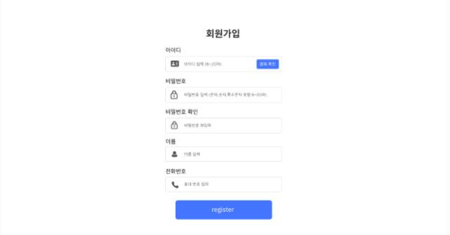
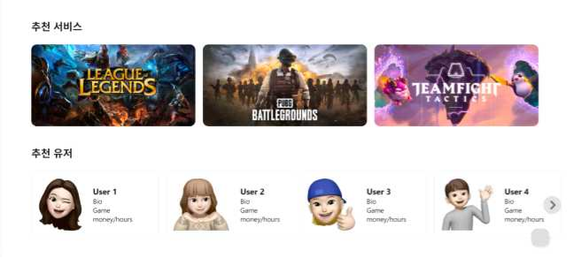
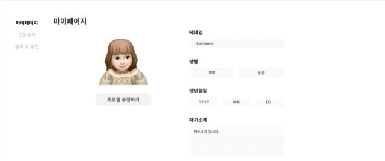
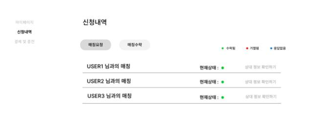
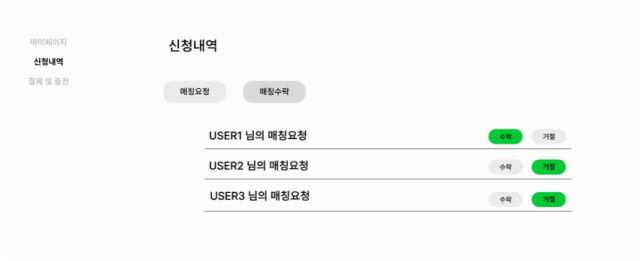
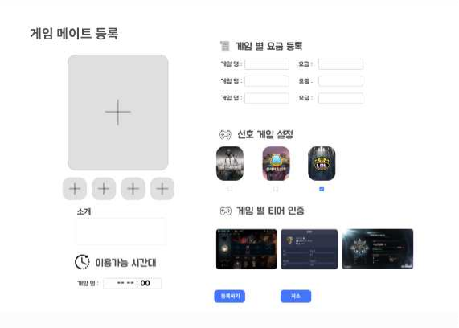
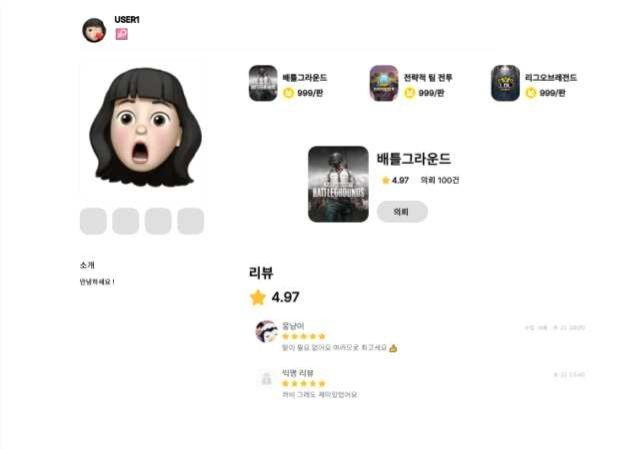
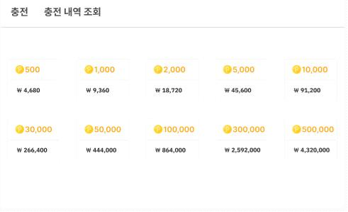
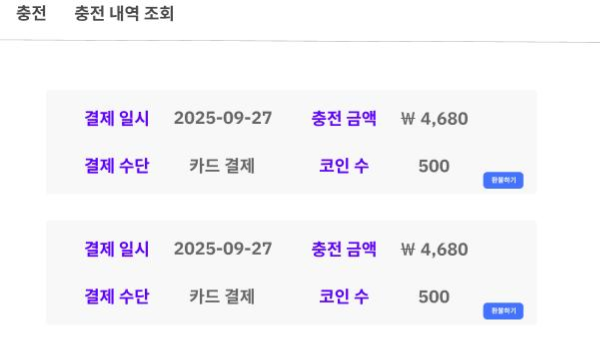

6\.  User  interface  prototype

`  `이  장은  개발  완료시  구성될  예상  UI와  각  구성요소에  대한  설명으로  이루어져  있다.

그림  [X-1]  로그인  화면 

`  `해당  그림은  로그인  화면의  구성이다.  아이디와  비밀번호를  입력하여  로그인  할  수  있고  신규회원을 위한  회원가입  기능과  비밀번호를  잊은경우  비밀번호를  재설정할  수  있는  버튼을  추가하였다.

그림  [X-2]  헤더  

해당  그림은  헤더의  구성이다.  헤더는  항상  유저에게  표시되며  자주  사용하는  다양한  기능을  빠르고  손 쉽게  접근할수  있도록  하였다.  Logo버튼을  클릭시  홈  화면으로  이동된다.  서비스  버튼을  클릭시  ~~  스 토리  ~~  하며  매칭  유저  검색기능,  코인  충전기능,  로그인,  회원가입  기능을  추가하여  각  기능들을  손 쉽게  이용할  수  있도록  하였다.  로그인  시  Login과  Join  버튼은  유저의  로그인  정보로  대체  될  예정이 다.

그림  4 

![ref1]

위  그림은  회원가입  화면이다.  회원가입 하여  회원가입을  할  수  있다.  비밀번호를 다.  또한  아이디의  중복을  방지하기위해 

시  필요한  정보들인  아이디,  비밀번호,  이름,  전화번호를  입력 잘못  기입할  경우를  방지하여  비밀번호  확인  박스를  추가하였

아이디  중복  확인을  진행하도록  하였다.

![ref1]

그림  5 

위  화면은  이  시스템의  홈  페이지이다.  추천  서비스  탭에있는  게임  화면을  선택하면  각  게임별  메이트 공고를  확인할  수  있는  페이지로  이동한다.  추천  유저탭에는  인기있는  유저의  메이트  공고를  확인할  수 있도록  하며  프로필  박스  클릭시  해당  유저의  메이트  공고  상세보기  페이지로  이동한다.

그림  6 

위의  그림은  마이페이지의  화면이다.  자신이  가입시  등록한  자신의  회원정보를  확인할  수  있다.  프로필 수정하기  버튼을  통해  변경된  회원정보를  수정할  수  있다.  왼쪽  상단의  탭을  이용하여  신청내역  페이지 와  결제  및  충전  페이지로  이동할  수  있다.

그림  7 

위의  그림은  신청내역  페이지의  매칭요청  화면이다.  메이트  공고를  올린  유저에게  신청한  매칭에  대한 내역  및  현재  상태를  확인  할  수  있다.  매칭을  신청한  유저의  닉네임과  함께  현재  수락,  거절,  응답없음

의  3가지  상태를  각  매칭에  대해  확인할  수  있다.

위의  그림은  신청내역  페이지의  매칭수락  화면이다.  메이트  공고를  올린  유저가  요청받은  신청한  매칭 에  대한  내역  및  현재  상태를  확인  할  수  있다.  매칭을  신청한  유저의  닉네임과  함께  수락,  거절  버튼 을  통해  해당  매칭에  대한  요청을  수락  또는  거절  할  수  있다.

그림  9 

위  그림은  게임  메이트  등록  화면이다.  자신을  보여줄  수  있는  이미지를  등록할  수  있다.  또한  소개글 을  입력할  수  있으며,  이용가능  시간대,  게임  별  요금,  선호게임,  게임의  실력을  인증할  수  있는  게임 별  티어  인증을  통해  각  게임에  대한  자신의  티어를  이미지를  통해  인증할  수  있다.

위  그림은  게임메이트  상세  화면이다.  [그림-xx]의  게임메이트  등록에서  등록한  정보대로  자신이  등록 한  이미지,  게임별  가격,  선호  게임,  소개를  바탕으로  공고글이  만들어진다.  해당  메이트와  게임을  한번 이라도  진행한  적이  있으면  리뷰를  작성할  수  있다.  5점만점의  총  별점을  확인할  수  있고  다른  유저가 등록한  리뷰를  확인할  수  있다.  또한  자신의  리뷰에  대해  수정  삭제,  기능을  통해  수정  및  삭제를  할 수  있다.

위  그림은  결제  및  충전화면에  충전  탭이다.  해당페이지에서  자신이  충전하고자  하는  양의  코인을  버튼 을  클릭해  충전할  수  있다.  버튼을  클릭시

위와같은  결제페이지로  화면이  전환되며  카드  결제,  계좌  이체,  간편  결제  중  원하는  방법으로  결제를 진행할  수  있다.

위  그림은  결제  및  충전에  충전  내역  조회  탭이다.  여기서  유저가  결제한  일시,  충전  금액,  결제수단, 충전한  코인  수와  같은  정보를  확인할  수  있다.

