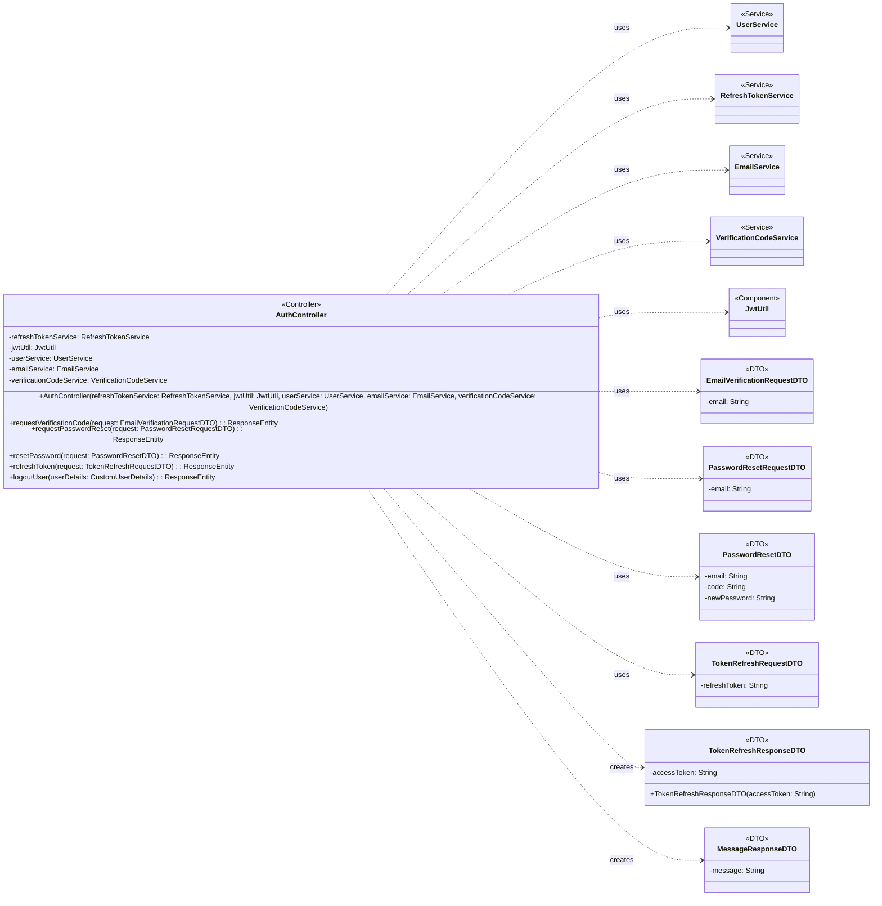

## Auth Class Diagram

 

## AuthController 클래스 정보

| 구분             | Name                      | Type                        | Visibility | Description                                      |
|:---------------|:--------------------------|:----------------------------|:-----------|:-------------------------------------------------|
| **class**      | **AuthController**        |                             |            | 인증 관련 HTTP 요청을 처리하는 REST 컨트롤러           |
| **Attributes** | refreshTokenService       | RefreshTokenService         | private    | 리프레시 토큰 관련 서비스를 처리하는 서비스              |
|                | jwtUtil                   | JwtUtil                     | private    | JWT 토큰 관련 유틸리티                             |
|                | userService               | UserService                 | private    | 사용자 관련 비즈니스 로직을 처리하는 서비스              |
|                | emailService              | EmailService                | private    | 이메일 발송 관련 비즈니스 로직을 처리하는 서비스         |
|                | verificationCodeService   | VerificationCodeService     | private    | 이메일 인증 코드 관련 비즈니스 로직을 처리하는 서비스      |
| **Operations** | AuthController            | void                        | public     | 생성자 (Lombok @RequiredArgsConstructor)         |
|                | requestVerificationCode   | ResponseEntity              | public     | 회원가입을 위한 이메일 인증 코드 발송을 요청하는 API 엔드포인트 |
|                | requestPasswordReset      | ResponseEntity              | public     | 비밀번호 재설정 이메일 발송을 요청하는 API 엔드포인트        |
|                | resetPassword             | ResponseEntity              | public     | 코드와 새 비밀번호로 비밀번호를 재설정하는 API 엔드포인트    |
|                | refreshToken              | ResponseEntity              | public     | 리프레시 토큰으로 새로운 액세스 토큰을 발급하는 API 엔드포인트 |
|                | logoutUser                | ResponseEntity              | public     | 사용자를 로그아웃 처리하는 API 엔드포인트 (리프레시 토큰 삭제) |

 

## EmailVerificationRequestDTO 클래스 정보

| 구분             | Name                          | Type   | Visibility | Description     |
|:---------------|:------------------------------|:-------|:-----------|:----------------|
| **class**      | **EmailVerificationRequestDTO** |        |            | 이메일 인증 요청 DTO |
| **Attributes** | email                         | String | private    | 인증 코드를 받을 이메일 주소 |

 

## PasswordResetRequestDTO 클래스 정보

| 구분             | Name                      | Type   | Visibility | Description          |
|:---------------|:--------------------------|:-------|:-----------|:---------------------|
| **class**      | **PasswordResetRequestDTO** |        |            | 비밀번호 재설정 요청 DTO |
| **Attributes** | email                     | String | private    | 재설정 인증코드를 받을 이메일 주소 |

 

## PasswordResetDTO 클래스 정보

| 구분             | Name              | Type   | Visibility | Description      |
|:---------------|:------------------|:-------|:-----------|:-----------------|
| **class**      | **PasswordResetDTO** |        |            | 비밀번호 재설정 DTO |
| **Attributes** | email             | String | private    | 사용자 이메일      |
|                | code              | String | private    | 이메일로 받은 인증코드 |
|                | newPassword       | String | private    | 새로 설정할 비밀번호   |

 

## TokenRefreshRequestDTO 클래스 정보

| 구분             | Name                     | Type   | Visibility | Description     |
|:---------------|:-------------------------|:-------|:-----------|:----------------|
| **class**      | **TokenRefreshRequestDTO** |        |            | 토큰 리프레시 요청 DTO |
| **Attributes** | refreshToken             | String | private    | 액세스 토큰 재발급에 사용할 리프레시 토큰 |

 

## TokenRefreshResponseDTO 클래스 정보

| 구분             | Name                      | Type   | Visibility | Description     |
|:---------------|:--------------------------|:-------|:-----------|:----------------|
| **class**      | **TokenRefreshResponseDTO** |        |            | 토큰 리프레시 응답 DTO |
| **Attributes** | accessToken               | String | private    | 새로 발급된 액세스 토큰 |
| **Operations** | TokenRefreshResponseDTO   | void   | public     | 생성자 (Lombok @AllArgsConstructor) |

 

## MessageResponseDTO 클래스 정보

| 구분             | Name                 | Type   | Visibility | Description     |
|:---------------|:---------------------|:-------|:-----------|:----------------|
| **class**      | **MessageResponseDTO** |        |            | 간단한 메시지 응답 DTO |
| **Attributes** | message              | String | private    | 응답 메시지       |
