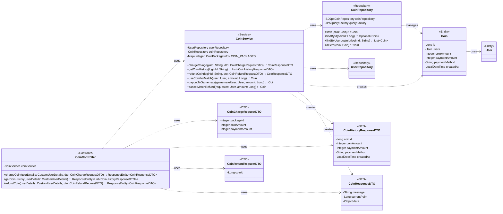

## Coin System Class Diagram

 

## CoinController 클래스 정보

| 구분             | Name               | Type                                     | Visibility | Description                                   |
|:---------------|:-------------------|:-----------------------------------------|:-----------|:----------------------------------------------|
| **class**      | **CoinController** |                                          |            | 코인 관련 HTTP 요청을 처리하는 REST 컨트롤러        |
| **Attributes** | coinService        | CoinService                              | private    | 코인 관련 비즈니스 로직을 처리하는 서비스             |
| **Operations** | chargeCoin         | ResponseEntity<CoinResponseDTO>          | public     | 코인 충전을 처리하는 API 엔드포인트                 |
|                | getCoinHistory     | ResponseEntity<List<CoinHistoryResponseDTO>> | public     | 코인 사용 내역을 조회하는 API 엔드포인트            |
|                | refundCoin         | ResponseEntity<CoinResponseDTO>          | public     | 코인 환불을 처리하는 API 엔드포인트                 |

 

## CoinService 클래스 정보

| 구분             | Name               | Type                        | Visibility | Description                                   |
|:---------------|:-------------------|:----------------------------|:-----------|:----------------------------------------------|
| **class**      | **CoinService**    |                             |            | 코인 관련 비즈니스 로직을 처리하는 서비스 클래스             |
| **Attributes** | userRepository     | UserRepository              | private    | 유저 정보 조회를 위함                               |
|                | coinRepository     | CoinRepository              | private    | 코인 정보 DB 작업을 위함                            |
|                | COIN_PACKAGES      | Map<Integer, CoinPackageInfo> | private    | 코인 충전 패키지 정보를 담고 있는 상수                |
| **Operations** | chargeCoin         | CoinResponseDTO             | public     | 코인을 충전하는 함수                                |
|                | getCoinHistory     | List<CoinHistoryResponseDTO>  | public     | 코인 사용 내역을 조회하는 함수                        |
|                | refundCoin         | CoinResponseDTO             | public     | 코인 환불을 처리하는 함수                           |
|                | useCoinForMatch    | Coin                        | public     | 매칭 시 코인을 사용하는 함수                        |
|                | payoutToGamemate   | Coin                        | public     | 매칭 수락 시 게임메이트에게 코인을 지급하는 함수          |
|                | cancelMatchRefund  | Coin                        | public     | 매칭 취소/거절 시 코인을 환불하는 함수                |

 

## CoinRepository 클래스 정보

| 구분             | Name               | Type                | Visibility | Description                                   |
|:---------------|:-------------------|:--------------------|:-----------|:----------------------------------------------|
| **class**      | **CoinRepository** |                     |            | 서비스에서 제공하는 코인 정보를 DB에서 조회/수정/삭제하기 위한 클래스 |
| **Attributes** | coinRepository     | SDJpaCoinRepository | private    | Spring Data JPA 기능을 사용하기 위함            |
|                | em                 | EntityManager       | private    | 엔티티 객체를 관리해주는 객체                              |
|                | queryFactory       | JPAQueryFactory     | private    | Query DSL 기능을 사용하기 위한 객체                      |
| **Operations** | CoinRepository     | void                | public     | CoinRepository 클래스 생성 및 초기화하는 생성자             |
|                | save               | Coin                | public     | 코인 거래 내역을 DB에 저장/수정하는 함수                  |
|                | findById           | Optional<Coin>      | public     | DB에 저장된 코인 정보를 coinId를 통해 조회하여 반환하는 함수    |
|                | findByUserLoginId  | List<Coin>          | public     | 특정 유저의 모든 코인 거래 내역을 조회하는 함수             |
|                | delete             | void                | public     | 특정 코인 거래 내역을 삭제하는 함수                      |

 

## Coin 클래스 정보

| 구분             | Name            | Type          | Visibility | Description                                      |
|:---------------|:----------------|:--------------|:-----------|:-------------------------------------------------|
| **class**      | **Coin**        |               |            | 데이터베이스의 `coin` 테이블과 매핑되는 JPA 엔티티        |
| **Attributes** | id              | Long          | private    | 코인 거래내역의 고유 ID (PK)                          |
|                | users           | User          | private    | 해당 거래내역의 사용자 (FK)                            |
|                | coinAmount      | Integer       | private    | 거래된 코인의 양 (충전: 양수, 사용: 음수)                 |
|                | paymentAmount   | Integer       | private    | 실제 결제된 금액 (충전 시에만 값 존재)                    |
|                | paymentMethod   | String        | private    | 거래 종류 (e.g., CHARGE, MATCH_PENDING)          |
|                | createdAt       | LocalDateTime | private    | 거래내역 생성 시간                                   |

 

## CoinChargeRequestDTO 클래스 정보
| 구분             | Name            | Type    | Visibility | Description      |
|:---------------|:----------------|:--------|:-----------|:-----------------|
| **class**      | **CoinChargeRequestDTO** | | | 코인 충전 요청 DTO |
| **Attributes** | packageId       | Integer | private    | 충전할 코인 패키지 ID |
|                | coinAmount      | Integer | private    | 충전할 코인 금액     |
|                | paymentAmount   | Integer | private    | 실제 결제 금액     |

 

## CoinHistoryResponseDTO 클래스 정보
| 구분             | Name            | Type          | Visibility | Description        |
|:---------------|:----------------|:--------------|:-----------|:-------------------|
| **class**      | **CoinHistoryResponseDTO** | | | 코인 내역 응답 DTO |
| **Attributes** | coinId          | Long          | private    | 거래내역 ID        |
|                | coinAmount      | Integer       | private    | 거래된 코인 양     |
|                | paymentAmount   | Integer       | private    | 실제 결제 금액     |
|                | paymentMethod   | String        | private    | 거래 종류          |
|                | createdAt       | LocalDateTime | private    | 거래 생성 시간     |

 

## CoinRefundRequestDTO 클래스 정보
| 구분             | Name            | Type    | Visibility | Description      |
|:---------------|:----------------|:--------|:-----------|:-----------------|
| **class**      | **CoinRefundRequestDTO** | | | 코인 환불 요청 DTO |
| **Attributes** | coinId          | Long    | private    | 환불할 거래내역 ID |

 

## CoinResponseDTO 클래스 정보
| 구분             | Name            | Type    | Visibility | Description        |
|:---------------|:----------------|:--------|:-----------|:-------------------|
| **class**      | **CoinResponseDTO** | | | 코인 관련 처리 결과 공통 응답 DTO |
| **Attributes** | message         | String  | private    | 처리 결과 메시지   |
|                | currentPoint    | Long    | private    | 처리 후 현재 포인트 |
|                | data            | Object  | private    | 추가 데이터        |
