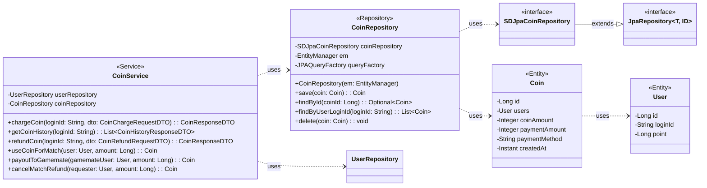

## Coin Class Diagram

 

## CoinRepository 클래스 정보

| 구분             | Name               | Type                | Visibility | Description                                   |
|:---------------|:-------------------|:--------------------|:-----------|:----------------------------------------------|
| **class**      | **CoinRepository** |                     |            | 서비스에서 제공하는 코인 정보를 DB에서 조회/수정/삭제하기 위한 클래스 |
| **Attributes** | coinRepository     | SDJpaCoinRepository | private    | 생성, 수정, 삭제, 조회 쿼리를 쉽게 사용하기 위한 Spring Data JPA |
|                | em                 | EntityManager       | private    | 엔티티 객체를 관리해주는 객체                              |
|                | queryFactory       | JPAQueryFactory     | private    | Query DSL 기능을 사용하기 위한 객체                      |
| **Operations** | CoinRepository     | void                | public     | CoinRepository 클래스 생성 및 초기화하는 생성자             |
|                | save               | Coin                | public     | 코인 거래 내역을 DB에 저장/수정하는 함수                  |
|                | findById           | Optional<Coin>      | public     | DB에 저장된 코인 정보를 coinId를 통해 조회하여 반환하는 함수    |
|                | findByUserLoginId  | List<Coin>          | public     | 특정 유저의 모든 코인 거래 내역을 조회하는 함수             |
|                | delete             | void                | public     | 특정 코인 거래 내역을 삭제하는 함수                      |

 

## CoinService 클래스 정보

| 구분             | Name               | Type                   | Visibility | Description                                   |
|:---------------|:-------------------|:-----------------------|:-----------|:----------------------------------------------|
| **class**      | **CoinService**    |                        |            | 코인 관련 비즈니스 로직을 처리하는 서비스 클래스             |
| **Attributes** | userRepository     | UserRepository         | private    | 유저 정보 조회를 위함                               |
|                | coinRepository     | CoinRepository         | private    | 코인 정보 DB 작업을 위함                            |
| **Operations** | chargeCoin         | CoinResponseDTO        | public     | 코인을 충전하는 함수                                |
|                | getCoinHistory     | List<CoinHistoryResponseDTO> | public     | 코인 사용 내역을 조회하는 함수                        |
|                | refundCoin         | CoinResponseDTO        | public     | 코인 환불을 처리하는 함수                           |
|                | useCoinForMatch    | Coin                   | public     | 매칭 시 코인을 사용하는 함수                        |
|                | payoutToGamemate   | Coin                   | public     | 매칭 수락 시 게임메이트에게 코인을 지급하는 함수          |
|                | cancelMatchRefund  | Coin                   | public     | 매칭 취소/거절 시 코인을 환불하는 함수                |
