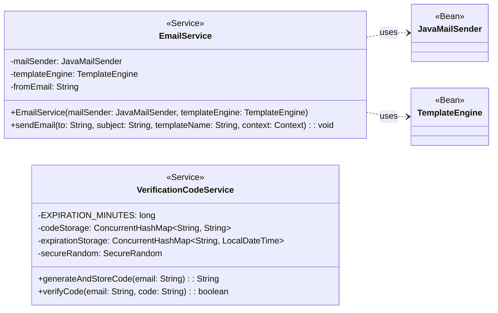

## Email System Class Diagram

 

## EmailService 클래스 정보

| 구분             | Name           | Type             | Visibility | Description                            |
|:---------------|:---------------|:-----------------|:-----------|:---------------------------------------|
| **class**      | **EmailService** |                  |            | 이메일 발송 기능을 담당하는 서비스 클래스          |
| **Attributes** | mailSender     | JavaMailSender   | private    | Spring의 메일 발송 기능을 사용하기 위한 의존성 |
|                | templateEngine | TemplateEngine   | private    | Thymeleaf 템플릿 엔진을 사용하기 위한 의존성   |
|                | fromEmail      | String           | private    | 발신자 이메일 주소 (설정값에서 주입)           |
| **Operations** | EmailService   | void             | public     | 생성자 (Lombok @RequiredArgsConstructor) |
|                | sendEmail      | void             | public     | 주어진 정보로 템플릿을 사용하여 이메일을 비동기 발송 |

 

## VerificationCodeService 클래스 정보

| 구분             | Name                  | Type                           | Visibility | Description                                    |
|:---------------|:----------------------|:-------------------------------|:-----------|:-----------------------------------------------|
| **class**      | **VerificationCodeService** |                                |            | 이메일 인증 코드의 생성, 저장, 검증을 담당하는 서비스 클래스 |
| **Attributes** | EXPIRATION_MINUTES    | long                           | private    | 인증 코드 유효 시간 (분 단위)                    |
|                | codeStorage           | ConcurrentHashMap<String, String> | private    | 이메일 주소를 키로, 인증 코드를 값으로 저장하는 맵     |
|                | expirationStorage     | ConcurrentHashMap<String, LocalDateTime> | private | 이메일 주소를 키로, 만료 시간을 값으로 저장하는 맵     |
|                | secureRandom          | SecureRandom                   | private    | 암호학적으로 안전한 난수 생성을 위한 객체            |
| **Operations** | generateAndStoreCode  | String                         | public     | 6자리 인증 코드를 생성하고 유효기간으로 저장           |
|                | verifyCode            | boolean                        | public     | 주어진 이메일과 코드가 유효한지 검증 (성공 시 코드 삭제) |
