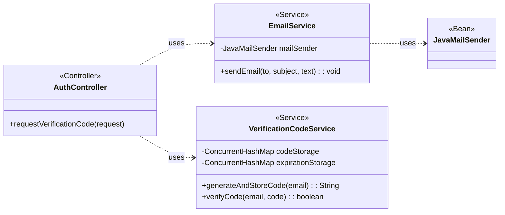

## Email System Class Diagram

 

## EmailService 클래스 정보

| 구분             | Name           | Type             | Visibility | Description                            |
|:---------------|:---------------|:-----------------|:-----------|:---------------------------------------|
| **class**      | **EmailService** |                  |            | 이메일 발송 기능을 담당하는 서비스 클래스          |
| **Attributes** | mailSender     | JavaMailSender   | private    | Spring의 메일 발송 기능을 사용하기 위한 의존성 |
| **Operations** | sendEmail      | void             | public     | 주어진 주소, 제목, 내용으로 이메일을 비동기 발송 |

 

## VerificationCodeService 클래스 정보

| 구분             | Name                  | Type                | Visibility | Description                                    |
|:---------------|:----------------------|:--------------------|:-----------|:-----------------------------------------------|
| **class**      | **VerificationCodeService** |                     |            | 이메일 인증 코드의 생성, 저장, 검증을 담당하는 서비스 클래스 |
| **Attributes** | codeStorage           | ConcurrentHashMap | private    | 이메일 주소를 키로, 인증 코드를 값으로 저장하는 맵     |
|                | expirationStorage     | ConcurrentHashMap | private    | 이메일 주소를 키로, 만료 시간을 값으로 저장하는 맵     |
| **Operations** | generateAndStoreCode  | String              | public     | 6자리 인증 코드를 생성하고 5분 유효기간으로 저장       |
|                | verifyCode            | boolean             | public     | 주어진 이메일과 코드가 유효한지 검증 (성공 시 코드 삭제) |
