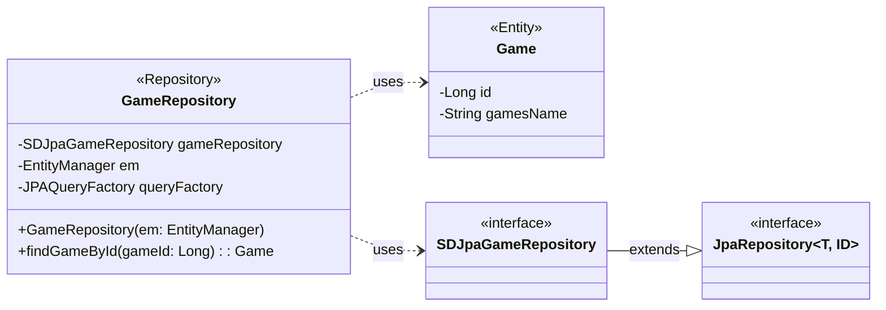

## Game Class Diagram

 

## GameRepository 클래스 정보

| 구분             | Name               | Type                | Visibility | Description                                   |
|:---------------|:-------------------|:--------------------|:-----------|:----------------------------------------------|
| **class**      | **GameRepository** |                     |            | 서비스에서 제공하는 게임 정보를 DB에서 조회하기 위한 클래스          |
| **Attributes** | gameRepository     | SDJpaGameRepository | private    | Spring Data JPA 기능을 사용하기 위함                   |
|                | em                 | EntityManager       | private    | 엔티티 객체를 관리해주는 객체                              |
|                | queryFactory       | JPAQueryFactory     | private    | Query DSL 기능을 사용하기 위한 객체                      |
| **Operations** | GameRepository     | void                | public     | GameRepository 클래스 생성 및 초기화하는 생성자             |
|                | findGameById       | Game                | public     | DB에 저장된 게임 정보를 게임ID를 통해 조회하여 반환하는 함수          |

 

## Game 클래스 정보

| 구분             | Name      | Type   | Visibility | Description                                      |
|:---------------|:----------|:-------|:-----------|:-------------------------------------------------|
| **class**      | **Game**  |        |            | 데이터베이스의 `games` 테이블과 매핑되는 JPA 엔티티        |
| **Attributes** | id        | Long   | private    | 게임의 고유 ID (PK)                                |
|                | gamesName | String | private    | 게임 이름                                         |

 

## SDJpaGameRepository 클래스 정보

| 구분             | Name                      | Type                            | Visibility | Description                                      |
|:---------------|:--------------------------|:--------------------------------|:-----------|:-------------------------------------------------|
| **interface**  | **SDJpaGameRepository**   |                                 |            | Spring Data JPA에서 `Game` 엔티티를 위한 리포지토리 인터페이스 |
| **Attributes** |                           |                                 |            |                                                  |
| **Operations** |                           | extends JpaRepository<Game, Long> | public     | `Game` 엔티티와 `Long` 타입 ID를 사용하는 JpaRepository 확장 |