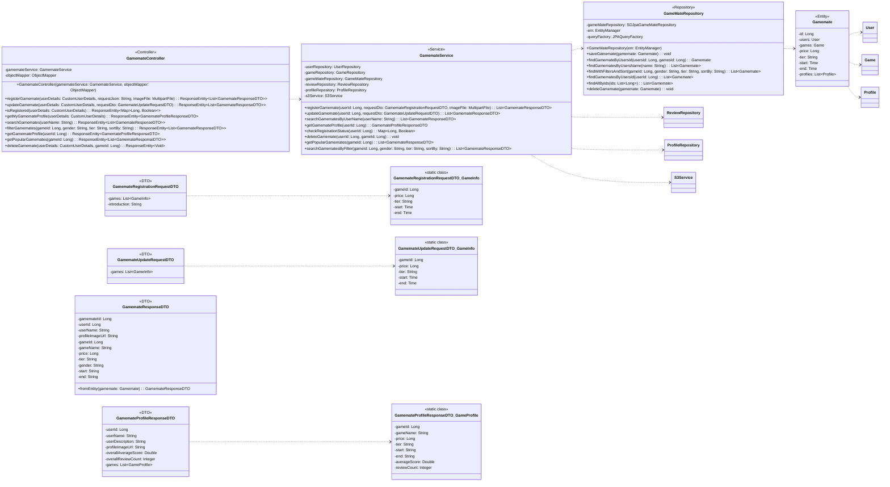

## Game Mate Class Diagram

 

## 1. GamemateController 클래스 정보

| 구분 | Name | Type | Visibility | Description |
|:---|:---|:---|:---|:---|
| **class** | **GamemateController** | | | 게임메이트 관련 HTTP 요청을 처리하는 REST 컨트롤러 |
| **Attributes** | gamemateService | GamemateService | private | 게임메이트 비즈니스 로직을 처리하는 서비스 객체 |
| | objectMapper | ObjectMapper | private | JSON 직렬화/역직렬화를 위한 객체 |
| **Operations** | registerGamemate | ResponseEntity~...~ | public | 새로운 게임메이트를 등록 (`POST`) |
| | updateGamemate | ResponseEntity~...~ | public | 게임메이트 정보를 동기화 (수정) (`PATCH`) |
| | isRegistered | ResponseEntity~...~ | public | 현재 유저의 게임별 등록 상태를 조회 (`GET /isRegistered`) |
| | getMyGamemateProfile | ResponseEntity~...~ | public | 현재 유저의 게임메이트 프로필을 조회 (`GET`) |
| | searchGamemates | ResponseEntity~...~ | public | 사용자 이름으로 게임메이트를 검색 (`GET /search`) |
| | filterGamemates | ResponseEntity~...~ | public | 조건으로 게임메이트를 필터링 검색 (`GET /filter`) |
| | getGamemateProfile | ResponseEntity~...~ | public | 특정 사용자의 프로필을 조회 (`GET /profile/{userId}`) |
| | getPopularGamemates | ResponseEntity~...~ | public | 인기 게임메이트를 조회 (`GET /popular/{gameId}`) |
| | deleteGamemate | ResponseEntity~Void~ | public | 게임메이트 등록을 삭제 (`DELETE /{gameId}`) |

 

## 2. GamemateService 클래스 정보 

| 구분 | Name | Type | Visibility | Description |
|:---|:---|:---|:---|:---|
| **class** | **GamemateService** | | | 게임메이트 관련 비즈니스 로직을 처리하는 서비스 객체 |
| **Attributes** | ... (dependencies) | ... | private | 다양한 DB 연산 및 비즈니스 로직을 위한 리포지토리 및 서비스 |
| **Operations** | registerGamemate | List~GamemateResponseDTO~ | public | 새로운 게임메이트를 등록하는 비즈니스 로직 |
| | updateGamemate | List~GamemateResponseDTO~ | public | 게임메이트 정보를 동기화하는 비즈니스 로직 |
| | searchGamematesByUserName | List~GamemateResponseDTO~ | public | 사용자 이름으로 게임메이트 목록을 검색 |
| | getGamemateProfile | GamemateProfileResponseDTO | public | 특정 사용자의 게임메이트 프로필을 조회 |
| | checkRegistrationStatus | Map~Long, Boolean~ | public | 현재 유저의 게임별 등록 상태를 조회 |
| | deleteGamemate | void | public | 특정 게임에 대한 사용자의 게임메이트 등록을 삭제 |
| | getPopularGamemates | List~GamemateResponseDTO~ | public | 특정 게임의 인기 게임메이트 목록을 조회 |
| | searchGamematesByFilter | List~GamemateResponseDTO~ | public | 다양한 필터와 정렬 조건으로 게임메이트를 검색 |

 

## 3. GameMateRepository 클래스 정보 

| 구분 | Name | Type | Visibility | Description |
|:---|:---|:---|:---|:---|
| **class** | **GameMateRepository** | | | DB에 저장된 게임메이트 정보를 관리하는 클래스 |
| **Attributes** | gameMateRepository | SDJpaGameMateRepository | private | Spring Data JPA 기능 사용 |
| | em | EntityManager | private | JPA 엔티티 관리 |
| | queryFactory | JPAQueryFactory | private | Query DSL 기능 사용 |
| **Operations** | saveGamemate | void | public | 게임메이트 정보를 DB에 저장/수정 |
| | findGamemateByUsersId | Gamemate | public | 사용자 ID와 게임 ID로 특정 게임메이트 정보를 조회 |
| | findGamematesByUsersName | List~Gamemate~ | public | 사용자 이름으로 게임메이트 목록을 조회 |
| | findWithFiltersAndSort | List~Gamemate~ | public | 동적 쿼리로 필터링 및 정렬하여 조회 |
| | findGamematesByUsersId | List~Gamemate~ | public | 사용자 ID로 모든 게임메이트 정보를 조회 |
| | findAllByIds | List~Gamemate~ | public | ID 목록으로 여러 게임메이트 정보를 조회 |
| | deleteGamemate | void | public | 게임메이트 정보를 DB에서 삭제 |

 

## 4. Gamemate 클래스 정보 

| 구분 | Name | Type | Visibility | Description |
|:---|:---|:---|:---|:---|
| **class** | **Gamemate** | | | 데이터베이스의 `gamemates` 테이블과 매핑되는 JPA 엔티티 |
| **Attributes** | id | Long | private | 게임메이트의 고유 ID (PK) |
| | users | User | private | 해당 게임메이트의 사용자 (FK) |
| | games | Game | private | 해당 게임메이트가 등록한 게임 (FK) |
| | price | Long | private | 게임 당 단가 |
| | tier | String | private | 게임 내 등급(티어) |
| | start | Time | private | 활동 시작 시간 |
| | end | Time | private | 활동 마감 시간 |
| | profiles | List~Profile~ | private | 게임메이트 프로필 이미지 목록 |

 

*(The file continues with DTO definitions which are now accurately represented in the Mermaid diagram above.)*