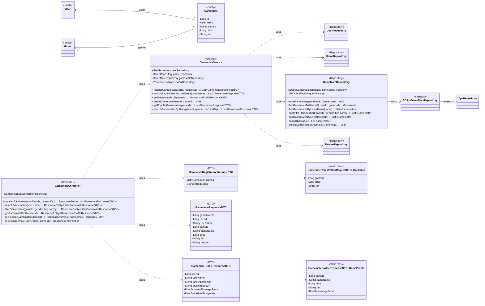

## Game Mate Class Diagram

 

## GamemateController 클래스 정보

| 구분             | Name                   | Type                                       | Visibility | Description                                                             |
|:---------------|:-----------------------|:-------------------------------------------|:-----------|:------------------------------------------------------------------------|
| **class**      | **GamemateController** |                                            |            | 게임메이트 관련 HTTP 요청을 처리하는 REST 컨트롤러                                 |
| **Attributes** | gamemateService        | GamemateService                            | private    | 게임메이트 비즈니스 로직을 처리하는 서비스 객체                                    |
| **Operations** | registerGamemate       | ResponseEntity~List~GamemateResponseDTO~~  | public     | 새로운 게임메이트를 등록하는 API 엔드포인트                                      |
|                | searchGamemates        | ResponseEntity~List~GamemateResponseDTO~~  | public     | 사용자 이름으로 게임메이트를 검색하는 API 엔드포인트                             |
|                | filterGamemates        | ResponseEntity~List~GamemateResponseDTO~~  | public     | 게임, 성별, 티어, 정렬 기준으로 게임메이트를 필터링 검색하는 API 엔드포인트         |
|                | getGamemateProfile     | ResponseEntity~GamemateProfileResponseDTO~ | public     | 특정 게임메이트의 상세 프로필을 조회하는 API 엔드포인트                            |
|                | getPopularGamemates    | ResponseEntity~List~GamemateResponseDTO~~  | public     | 특정 게임의 인기 게임메이트 4명을 조회하는 API 엔드포인트                        |
|                | deleteGamemate         | ResponseEntity~Void~                       | public     | 특정 게임에 대한 게임메이트 등록을 삭제하는 API 엔드포인트                         |

 

## GamemateService 클래스 정보

| 구분             | Name                      | Type                       | Visibility | Description                                                                      |
|:---------------|:--------------------------|:---------------------------|:-----------|:---------------------------------------------------------------------------------|
| **class**      | **GamemateService**       |                            |            | 게임메이트 관련 비즈니스 로직을 처리하는 서비스 객체                                   |
| **Attributes** | userRepository            | UserRepository             | private    | 사용자 정보(User)에 대한 데이터베이스 연산을 담당하는 리포지토리                      |
|                | gameRepository            | GameRepository             | private    | 게임 정보(Game)에 대한 데이터베이스 연산을 담당하는 리포지토리                        |
|                | gameMateRepository        | GameMateRepository         | private    | 게임메이트 정보(Gamemate)에 대한 데이터베이스 연산을 담당하는 리포지토리            |
|                | reviewRepository          | ReviewRepository           | private    | 리뷰 정보(Review)에 대한 데이터베이스 연산을 담당하는 리포지토리                     |
| **Operations** | registerGamemate          | List~GamemateResponseDTO~  | public     | 새로운 게임메이트를 등록하는 비즈니스 로직                                         |
|                | searchGamematesByUserName | List~GamemateResponseDTO~  | public     | 사용자 이름으로 게임메이트 목록을 검색하는 비즈니스 로직                             |
|                | getGamemateProfile        | GamemateProfileResponseDTO | public     | 특정 사용자의 게임메이트 프로필을 조회하는 비즈니스 로직                               |
|                | deleteGamemate            | void                       | public     | 특정 게임에 대한 사용자의 게임메이트 등록을 삭제하는 비즈니스 로직                     |
|                | getPopularGamemates       | List~GamemateResponseDTO~  | public     | 특정 게임의 인기 게임메이트 목록을 조회하는 비즈니스 로직                            |
|                | searchGamematesByFilter   | List~GamemateResponseDTO~  | public     | 다양한 필터와 정렬 조건으로 게임메이트를 검색하는 비즈니스 로직                      |

 

## GameMateRepository 클래스 정보

| 구분             | Name                     | Type                    | Visibility | Description                                   |
|:---------------|:-------------------------|:------------------------|:-----------|:----------------------------------------------|
| **class**      | **GameMateRepository**   |                         |            | DB에 저장된 게임메이트 정보를 생성, 수정, 삭제, 조회를 위한 클래스    |
| **Attributes** | gameMateRepository       | SDJpaGameMateRepository | private    | Spring Data JPA 기능을 사용하기 위함            |
|                | queryFactory             | JPAQueryFactory         | private    | Query DSL 기능을 사용하기 위한 객체                      |
| **Operations** | saveGamemate             | void                    | public     | 게임메이트 정보를 DB에 저장하는 함수                         |
|                | findGamemateByUsersId    | Gamemate                | public     | 사용자 ID와 게임 ID로 특정 게임메이트 정보를 조회하는 함수      |
|                | findGamematesByUsersName | List~Gamemate~          | public     | 사용자 이름으로 게임메이트 목록을 조회하는 함수                 |
|                | findWithFiltersAndSort   | List~Gamemate~          | public     | 게임, 성별, 티어, 정렬 기준으로 동적 쿼리를 생성하여 조회하는 함수 |
|                | findGamematesByUsersId   | List~Gamemate~          | public     | 사용자 ID로 해당 유저의 모든 게임메이트 정보를 조회하는 함수      |
|                | findAllByIds             | List~Gamemate~          | public     | ID 목록으로 여러 게임메이트 정보를 조회하는 함수            |
|                | deleteGamemate           | void                    | public     | 게임메이트 정보를 DB에서 삭제하는 함수                        |

 

## Gamemate 클래스 정보

| 구분             | Name         | Type | Visibility | Description                                    |
|:---------------|:-------------|:-----|:-----------|:-----------------------------------------------|
| **class**      | **Gamemate** |      |            | 데이터베이스의 `gamemates` 테이블과 매핑되는 JPA 엔티티   |
| **Attributes** | id           | Long | private    | 게임메이트의 고유 ID (PK)                            |
|                | users        | User | private    | 해당 게임메이트의 사용자 (FK)                        |
|                | games        | Game | private    | 해당 게임메이트가 등록한 게임 (FK)                    |
|                | price        | Long | private    | 게임 당 단가                                     |
|                | tier         | String | private    | 게임 내 등급(티어)                                 |

 

## GamemateRegistrationRequestDTO 클래스 정보

| 구분             | Name                               | Type             | Visibility | Description                           |
|:---------------|:-----------------------------------|:-----------------|:-----------|:--------------------------------------|
| **class**      | **GamemateRegistrationRequestDTO** |                  |            | 게임메이트 등록 요청 DTO                  |
| **Attributes** | games                              | List~GameInfo~   | private    | 등록할 게임 목록 (ID, 가격, 티어 포함)      |
|                | introduction                       | String           | private    | 자기소개                              |

 

## GamemateResponseDTO 클래스 정보

| 구분             | Name                    | Type   | Visibility | Description                                        |
|:---------------|:------------------------|:-------|:-----------|:---------------------------------------------------|
| **class**      | **GamemateResponseDTO** |        |            | 게임메이트 정보 응답 DTO                               |
| **Attributes** | gamemateId              | Long   | private    | 등록된 게임메이트의 고유 ID                              |
|                | userId                  | Long   | private    | 해당 게임메이트의 사용자 ID                              |
|                | userName                | String | private    | 해당 게임메이트의 사용자 이름                              |
|                | gameId                  | Long   | private    | 등록된 게임의 고유 ID                                  |
|                | gameName                | String | private    | 등록된 게임의 이름                                     |
|                | price                   | Long   | private    | 해당 게임에 대해 설정된 시간당 가격                         |
|                | tier                    | String | private    | 해당 게임에 대해 설정된 티어                           |
|                | gender                  | String | private    | 해당 게임메이트의 성별                               |
| **Operations** | fromEntity              | GamemateResponseDTO | public     | Gamemate 엔티티를 DTO로 변환하는 정적 팩토리 메서드 |

 

## GamemateProfileResponseDTO 클래스 정보

| 구분             | Name                           | Type                | Visibility | Description                          |
|:---------------|:-------------------------------|:--------------------|:-----------|:-------------------------------------|
| **class**      | **GamemateProfileResponseDTO** |                     |            | 게임메이트 프로필 정보 응답 DTO          |
| **Attributes** | userId                         | Long                | private    | 프로필 대상 사용자의 고유 ID                 |
|                | userName                       | String              | private    | 사용자 이름                            |
|                | userDescription                | String              | private    | 사용자 자기소개                        |
|                | profileImageUrl                | String              | private    | 사용자 프로필 이미지 URL                 |
|                | overallAverageScore            | Double              | private    | 해당 사용자가 받은 모든 리뷰의 평균 평점     |
|                | games                          | List~GameProfile~   | private    | 등록한 게임별 상세 프로필 목록           |
