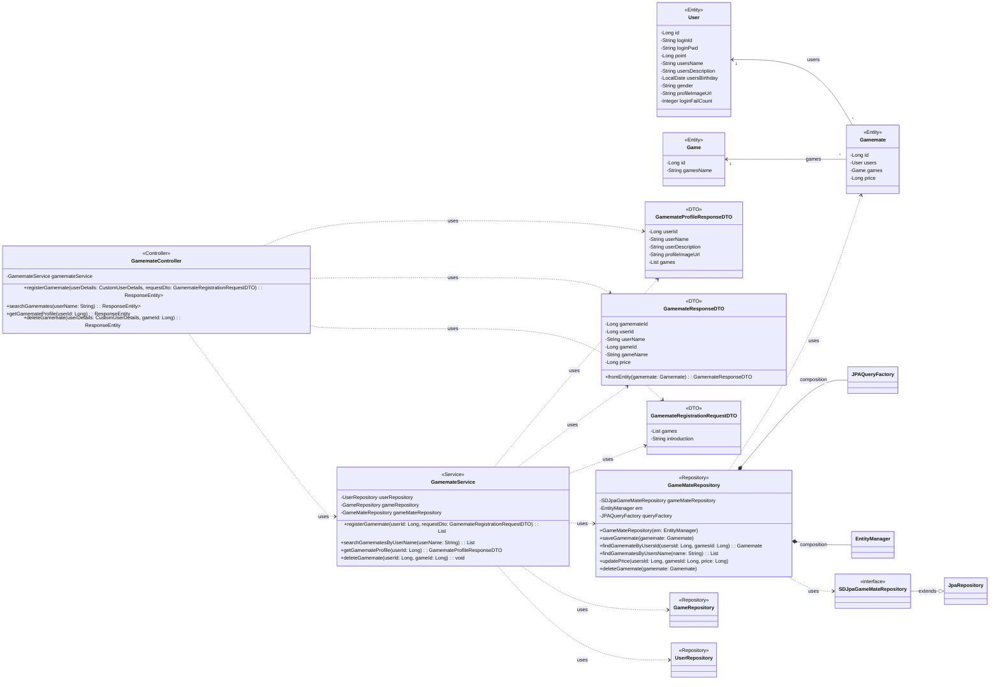

## Game Mate Class Diagram

## Gamemate 클래스 정보

| 구분             | Name         | Type | Visibility | Description                                    |
|:---------------|:-------------|:-----|:-----------|:-----------------------------------------------|
| **class**      | **Gamemate** |      |            | 데이터베이스의 gamemates 테이블과 매핑되는 JPA 객체             |
| **Attributes** | id           | Long | private    | DB의 PK로서 gamemates_id 컬럼과 매핑되는 변수              |
|                | users        | User | private    | DB의 users_id 컬럼과 매핑되는 변수로 User의 정보를 받아오기 위한 변수 |
|                | games        | Game | private    | DB의 games_id 컬럼과 매핑되는 변수로 Game의 정보를 받아오기 위한 변수 |
|                | price        | Long | private    | DB의 price 컬럼과 매핑되는 변수로 게임 당 단가를 저장하는 변수        |

## Game 클래스 정보

| 구분             | Name      | Type   | Visibility | Description                                      |
|:---------------|:----------|:-------|:-----------|:-------------------------------------------------|
| **class**      | **Game**  |        |            | 데이터베이스의 game 테이블과 매핑되는 JPA 객체                    |
| **Attributes** | id        | Long   | private    | DB의 PK로서 games_id 컬럼과 매핑되는 변수                    |
|                | gamesName | String | private    | DB의 games_name 컬럼과 매핑되는 변수로 game의 이름을 가져오기 위한 변수 |

## GameMateRepository 클래스 정보

| 구분             | Name                     | Type                    | Visibility | Description                                   |
|:---------------|:-------------------------|:------------------------|:-----------|:----------------------------------------------|
| **class**      | **GameMateRepository**   |                         |            | DB에 저장된 게임메이트 정보를 생성, 수정, 삭제, 조회를 위한 class    |
| **Attributes** | gameMateRepository       | SDJpaGameMateRepository | private    | 생성, 수정, 삭제, 조회 쿼리를 쉽게 사용하기 위한 Spring Data JPA |
|                | em                       | EntityManager           | private    | 엔티티 객체를 관리해주는 객체                              |
|                | queryFactory             | JPAQueryFactory         | private    | Query DSL 기능을 사용하기 위한 객체                      |
| **Operations** | GameMateRepository       | void                    | public     | GameMateRepository 클래스 생성 및 초기화하는 생성자         |
|                | saveGamemate             | void                    | public     | 게임메이트 정보를 DB에 저장하는 함수                         |
|                | findGamemateByUsersId    | Gamemate                | public     | DB에 저장된 게임메이트 정보를 사용자ID를 통해 조회하여 반환하는 함수      |
|                | findGamematesByUsersName | List<Gamemate>          | public     | DB에 저장된 게임메이트 정보를 사용자 이름을 통해 조회하여 반환하는 함수     |
|                | updatePrice              | void                    | public     | 사용자가 초기에 설정해놓은 게임 당 단가를 변경하는 함수               |
|                | deleteGamemate           | void                    | public     | 게임메이트 정보를 DB에서 삭제하는 함수                        |

## GamemateController 클래스 정보

| 구분             | Name                   | Type                                       | Visibility | Description                                                             |
|:---------------|:-----------------------|:-------------------------------------------|:-----------|:------------------------------------------------------------------------|
| **class**      | **GamemateController** |                                            |            | 게임메이트 관련 HTTP 요청을 처리하는 REST 컨트롤러. 클라이언트의 요청을 받아 GamemateService로 전달     |
| **Attributes** | gamemateService        | GamemateService                            | private    | 게임메이트 비즈니스 로직을 처리하는 서비스 객체. GamemateController의 핵심 로직을 위임받아 처리          |
| **Operations** | registerGamemate       | ResponseEntity<List<GamemateResponseDTO>>  | public     | 새로운 게임메이트를 등록하는 API 엔드포인트. 요청 DTO와 인증된 사용자 정보를 받아 GamemateService에 전달   |
|                | searchGamemates        | ResponseEntity<List<GamemateResponseDTO>>  | public     | 사용자 이름으로 게임메이트를 검색하는 API 엔드포인트. 쿼리 파라미터로 받은 사용자 이름을 GamemateService에 전달 |
|                | getGamemateProfile     | ResponseEntity<GamemateProfileResponseDTO> | public     | 특정 게임메이트의 상세 프로필을 조회하는 API 엔드포인트. 경로 변수로 받은 사용자 ID를 GamemateService에 전달 |
|                | deleteGamemate         | ResponseEntity<Void>                       | public     | 특정 게임에 대한 게임메이트 등록을 삭제하는 API 엔드포인트.                                     |

## GamemateService 클래스 정보

| 구분             | Name                      | Type                       | Visibility | Description                                                                      |
|:---------------|:--------------------------|:---------------------------|:-----------|:---------------------------------------------------------------------------------|
| **class**      | **GamemateService**       |                            |            | 게임메이트 관련 비즈니스 로직을 처리하는 서비스 객체. 데이터베이스와 상호작용하며 핵심 기능을 수행                          |
| **Attributes** | userRepository            | UserRepository             | private    | 사용자 정보(User 엔티티)에 대한 데이터베이스 연산을 담당하는 리포지토리 객체                                    |
|                | gameRepository            | GameRepository             | private    | 게임 정보(Game 엔티티)에 대한 데이터베이스 연산을 담당하는 리포지토리 객체                                     |
|                | gameMateRepository        | GameMateRepository         | private    | 게임메이트 정보(Gamemate 엔티티)에 대한 데이터베이스 연산을 담당하는 리포지토리 객체                              |
| **Operations** | registerGamemate          | List<GamemateResponseDTO>  | public     | 새로운 게임메이트를 등록하는 비즈니스 로직. 사용자 정보 업데이트, 게임메이트 중복 확인, Gamemate 엔티티 저장 등의 작업을 수행     |
|                | searchGamematesByUserName | List<GamemateResponseDTO>  | public     | 사용자 이름으로 게임메이트 목록을 검색하는 비즈니스 로직. GameMateRepository를 통해 게임메이트를 조회하고 DTO로 변환하여 반환 |
|                | getGamemateProfile        | GamemateProfileResponseDTO | public     | 특정 사용자의 게임메이트 프로필을 조회하는 비즈니스 로직. 사용자 정보와 해당 사용자가 등록한 게임메이트 정보를 통합하여 프로필 DTO를 생성  |
|                | deleteGamemate            | void                       | public     | 특정 게임에 대한 사용자의 게임메이트 등록을 삭제하는 비즈니스 로직.                                           |

## GamemateRegistrationRequestDTO 클래스 정보

| 구분             | Name                               | Type           | Visibility | Description                           |
|:---------------|:-----------------------------------|:---------------|:-----------|:--------------------------------------|
| **class**      | **GamemateRegistrationRequestDTO** |                |            | 게임메이트 등록 요청 시 클라이언트로부터 받는 데이터를 담는 DTO |
| **Attributes** | games                              | List<GameInfo> | private    | 등록할 게임 목록. 각 게임의 ID와 시간당 가격 정보를 포함    |
|                | introduction                       | String         | private    | 게임메이트로서의 자기소개 또는 각오                   |

## GamemateResponseDTO 클래스 정보

| 구분             | Name                    | Type                | Visibility | Description                                        |
|:---------------|:------------------------|:--------------------|:-----------|:---------------------------------------------------|
| **class**      | **GamemateResponseDTO** |                     |            | 게임메이트 정보를 클라이언트에 응답할 때 사용하는 DTO                    |
| **Attributes** | gamemateId              | Long                | private    | 등록된 게임메이트의 고유 ID                                   |
|                | userId                  | Long                | private    | 해당 게임메이트의 사용자 ID                                   |
|                | userName                | String              | private    | 해당 게임메이트의 사용자 이름                                   |
|                | gameId                  | Long                | private    | 등록된 게임의 고유 ID                                      |
|                | gameName                | String              | private    | 등록된 게임의 이름                                         |
|                | price                   | Long                | private    | 해당 게임에 대해 설정된 시간당 가격                               |
| **Operations** | fromEntity              | GamemateResponseDTO | public     | Gamemate 엔티티를 GamemateResponseDTO로 변환하는 정적 팩토리 메서드 |

## GamemateProfileResponseDTO 클래스 정보

| 구분             | Name                           | Type                | Visibility | Description                          |
|:---------------|:-------------------------------|:--------------------|:-----------|:-------------------------------------|
| **class**      | **GamemateProfileResponseDTO** |                     |            | 게임메이트의 프로필 정보를 클라이언트에 응답할 때 사용하는 DTO |
| **Attributes** | userId                         | Long                | private    | 프로필의 대상이 되는 사용자의 고유 ID               |
|                | userName                       | String              | private    | 사용자의 현재 이름                           |
|                | userDescription                | String              | private    | 사용자가 작성한 자기소개                        |
|                | profileImageUrl                | String              | private    | 사용자의 프로필 이미지 URL                     |
|                | games                          | List<GameWithPrice> | private    | 해당 게임메이트가 등록한 모든 게임의 목록과 각각의 가격 정보   |