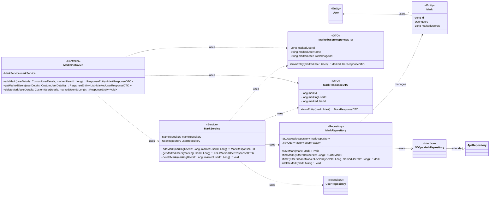

## Mark Class Diagram

 

## MarkController 클래스 정보

| 구분             | Name               | Type                                        | Visibility | Description                                                           |
|:---------------|:-------------------|:--------------------------------------------|:-----------|:----------------------------------------------------------------------|
| **class**      | **MarkController** |                                             |            | 즐겨찾기 관련 HTTP 요청을 처리하는 REST 컨트롤러                                |
| **Attributes** | markService        | MarkService                                 | private    | 즐겨찾기 비즈니스 로직을 처리하는 서비스 객체                                   |
| **Operations** | addMark            | ResponseEntity~MarkResponseDTO~             | public     | 특정 사용자를 즐겨찾기에 추가하는 API 엔드포인트                            |
|                | getMarkedUsers     | ResponseEntity~List~MarkedUserResponseDTO~~ | public     | 현재 로그인된 사용자가 즐겨찾기한 모든 사용자 목록을 조회하는 API 엔드포인트     |
|                | deleteMark         | ResponseEntity~Void~                        | public     | 특정 사용자를 즐겨찾기에서 삭제하는 API 엔드포인트                            |

 

## MarkService 클래스 정보

| 구분             | Name            | Type                        | Visibility | Description                                                |
|:---------------|:----------------|:----------------------------|:-----------|:-----------------------------------------------------------|
| **class**      | **MarkService** |                             |            | 즐겨찾기 관련 비즈니스 로직을 처리하는 서비스 객체                          |
| **Attributes** | markRepository  | MarkRepository              | private    | 즐겨찾기 정보(Mark)에 대한 데이터베이스 연산을 담당하는 리포지토리         |
|                | userRepository  | UserRepository              | private    | 사용자 정보(User)에 대한 데이터베이스 연산을 담당하는 리포지토리            |
| **Operations** | addMark         | MarkResponseDTO             | public     | 특정 사용자를 즐겨찾기에 추가하는 비즈니스 로직                          |
|                | getMarkedUsers  | List~MarkedUserResponseDTO~ | public     | 특정 사용자가 즐겨찾기한 모든 사용자의 정보를 조회하는 비즈니스 로직         |
|                | deleteMark      | void                        | public     | 특정 사용자를 즐겨찾기 목록에서 삭제하는 비즈니스 로직                     |

 

## MarkRepository 클래스 정보

| 구분             | Name                          | Type                | Visibility | Description                                   |
|:---------------|:------------------------------|:--------------------|:-----------|:----------------------------------------------|
| **class**      | **MarkRepository**            |                     |            | DB에 저장된 즐겨찾기 정보를 관리하기 위한 클래스                 |
| **Attributes** | markRepository                | SDJpaMarkRepository | private    | Spring Data JPA 기능을 사용하기 위함            |
|                | queryFactory                  | JPAQueryFactory     | private    | Query DSL 기능을 사용하기 위한 객체                      |
| **Operations** | saveMark                      | void                | public     | 즐겨찾기 정보를 DB에 저장하는 함수                          |
|                | findMarkByUsersId             | List~Mark~          | public     | 사용자 ID로 해당 유저의 모든 즐겨찾기 정보를 조회하는 함수     |
|                | findByUsersIdAndMarkedUsersId | Mark                | public     | 특정 사용자가 특정 사용자를 즐겨찾기 했는지 확인하는 함수 |
|                | deleteMark                    | void                | public     | 즐겨찾기 정보를 DB에서 삭제하는 함수                         |

 

## Mark 클래스 정보

| 구분             | Name          | Type | Visibility | Description                                      |
|:---------------|:--------------|:-----|:-----------|:-------------------------------------------------|
| **class**      | **Mark**      |      |            | 데이터베이스의 `marks` 테이블과 매핑되는 JPA 엔티티       |
| **Attributes** | id            | Long | private    | 즐겨찾기의 고유 ID (PK)                              |
|                | users         | User | private    | 즐겨찾기를 등록한 사용자 (FK)                        |
|                | markedUsersId | Long | private    | 즐겨찾기 대상이 된 사용자의 ID                       |

 

## MarkedUserResponseDTO 클래스 정보

| 구분             | Name                      | Type                  | Visibility | Description                                      |
|:---------------|:--------------------------|:----------------------|:-----------|:-------------------------------------------------|
| **class**      | **MarkedUserResponseDTO** |                       |            | 즐겨찾기된 사용자 정보 응답 DTO                          |
| **Attributes** | markedUserId              | Long                  | private    | 즐겨찾기된 사용자의 고유 ID                            |
|                | markedUserName            | String                | private    | 즐겨찾기된 사용자의 이름                               |
|                | markedUserProfileImageUrl | String                | private    | 즐겨찾기된 사용자의 프로필 이미지 URL                    |
| **Operations** | fromEntity                | MarkedUserResponseDTO | public     | User 엔티티를 DTO로 변환하는 정적 팩토리 메서드       |

 

## MarkResponseDTO 클래스 정보

| 구분             | Name                | Type            | Visibility | Description                                |
|:---------------|:--------------------|:----------------|:-----------|:-------------------------------------------|
| **class**      | **MarkResponseDTO** |                 |            | 즐겨찾기 생성/삭제 시 결과 응답 DTO                  |
| **Attributes** | markId              | Long            | private    | 생성된 즐겨찾기의 고유 ID                            |
|                | markingUserId       | Long            | private    | 즐겨찾기를 한 사용자의 ID                            |
|                | markedUserId        | Long            | private    | 즐겨찾기된 사용자의 ID                              |
| **Operations** | fromEntity          | MarkResponseDTO | public     | Mark 엔티티를 DTO로 변환하는 정적 팩토리 메서드 |
