## Mark Class Diagram

```mermaid
classDiagram
    direction LR

    class MarkController {
        <<Controller>>
        -MarkService markService
        +addMark(userDetails: CustomUserDetails, markedUserId: Long): ResponseEntity<MarkResponseDTO>
        +getMarkedUsers(userDetails: CustomUserDetails): ResponseEntity<List<MarkedUserResponseDTO>>
        +deleteMark(userDetails: CustomUserDetails, markedUserId: Long): ResponseEntity<Void>
    }

    class MarkService {
        <<Service>>
        -MarkRepository markRepository
        -UserRepository userRepository
        +addMark(markingUserId: Long, markedUserId: Long): MarkResponseDTO
        +getMarkedUsers(markingUserId: Long): List<MarkedUserResponseDTO>
        +deleteMark(markingUserId: Long, markedUserId: Long)
    }

    class MarkRepository {
        <<Repository>>
        -SDJpaMarkRepository markRepository
        -EntityManager em
        -JPAQueryFactory queryFactory
        +MarkRepository(em: EntityManager)
        +saveMark(mark: Mark)
        +findMarkByUsersId(usersId: Long): List<Mark>
        +findByUsersIdAndMarkedUsersId(usersId: Long, markedUsersId: Long): Mark
        +deleteMark(mark: Mark)
    }

    class Mark {
        <<Entity>>
        -Long id
        -User users
        -Long markedUsersId
    }

    class User {
        <<Entity>>
        -Long id
        -String loginId
        -String loginPwd
        -Long point
        -String usersName
        -String usersDescription
        -LocalDate usersBirthday
        -String gender
        -String profileImageUrl
        -Integer loginFailCount
    }

    class SDJpaMarkRepository {
        <<interface>>
    }

    class UserRepository {
        <<Repository>>
    }

    class EntityManager {
    }

    class JPAQueryFactory {
    }

    class JpaRepository~T, ID~ {
        <<interface>>
    }

    class MarkedUserResponseDTO {
        <<DTO>>
        -Long markedUserId
        -String markedUserName
        -String markedUserProfileImageUrl
        +fromEntity(markedUser: User): MarkedUserResponseDTO
    }

    class MarkResponseDTO {
        <<DTO>>
        -Long markId
        -Long markingUserId
        -Long markedUserId
        +fromEntity(mark: Mark): MarkResponseDTO
    }

    %% Relationships
    MarkController ..> MarkService : uses
    MarkService ..> MarkRepository : uses
    MarkService ..> UserRepository : uses
    SDJpaMarkRepository --|> JpaRepository : extends
    MarkRepository ..> SDJpaMarkRepository : uses
    MarkRepository *-- EntityManager : composition
    MarkRepository *-- JPAQueryFactory : composition
    MarkRepository ..> Mark : uses
    User "1" <-- "*" Mark : users
    MarkController ..> MarkedUserResponseDTO : uses
    MarkController ..> MarkResponseDTO : uses
    MarkService ..> MarkedUserResponseDTO : uses
    MarkService ..> MarkResponseDTO : uses
```

## Mark 클래스 정보

| 구분             | Name          | Type | Visibility | Description                                                        |
|:---------------|:--------------|:-----|:-----------|:-------------------------------------------------------------------|
| **class**      | **Mark**      |      |            | 데이터베이스의 mark 테이블과 매핑되는 JPA 객체                                      |
| **Attributes** | id            | Long | private    | DB의 PK로서 marks_id 컬럼과 매핑되는 변수                                      |
|                | users         | User | private    | DB의 users_id 컬럼과 매핑되는 변수로 User의 정보를 받아오기 위한 변수                     |
|                | markedUsersId | Long | private    | DB의 marked_users_id 컬럼과 매핑되는 변수로 즐겨찾기로 등록한 다른 사용자ID 정보를 받아오기 위한 변수 |
|                | price         | Long | private    | DB의 price 컬럼과 매핑되는 변수로 게임 당 단가를 저장하는 변수                            |

## MarkRepository 클래스 정보

| 구분             | Name                          | Type                | Visibility | Description                                   |
|:---------------|:------------------------------|:--------------------|:-----------|:----------------------------------------------|
| **class**      | **MarkRepository**            |                     |            | DB에 저장된 즐겨찾기 정보를 생성, 수정, 삭제, 조회를 위한 class     |
| **Attributes** | markRepository                | SDJpaMarkRepository | private    | 생성, 수정, 삭제, 조회 쿼리를 쉽게 사용하기 위한 Spring Data JPA |
|                | em                            | EntityManager       | private    | 엔티티 객체를 관리해주는 객체                              |
|                | queryFactory                  | JPAQueryFactory     | private    | Query DSL 기능을 사용하기 위한 객체                      |
| **Operations** | MarkRepository                | void                | public     | markRepository 클래스 생성 및 초기화하는 생성자             |
|                | saveMark                      | void                | public     | 즐겨찾기 정보를 DB에 저장하는 함수                          |
|                | findMarkByUsersId             | List<Mark>          | public     | DB에 저장된 즐겨찾기 정보를 사용자ID를 통해 조회하여 반환하는 함수       |
|                | findByUsersIdAndMarkedUsersId | Mark                | public     | 사용자ID를 통해 DB에 즐겨찾기로 등록된 특정 사용자를 조회하여 반환하는 함수  |
|                | deleteMark                    | void                | public     | 즐겨찾기 정보를 DB에서 삭제하는 함수                         |

## MarkController 클래스 정보

| 구분             | Name               | Type                                        | Visibility | Description                                                           |
|:---------------|:-------------------|:--------------------------------------------|:-----------|:----------------------------------------------------------------------|
| **class**      | **MarkController** |                                             |            | 즐겨찾기 관련 HTTP 요청을 처리하는 REST 컨트롤러. 클라이언트의 요청을 받아 MarkService로 전달        |
| **Attributes** | markService        | MarkService                                 | private    | 즐겨찾기 비즈니스 로직을 처리하는 서비스 객체. MarkController의 핵심 로직을 위임받아 처리             |
| **Operations** | addMark            | ResponseEntity<MarkResponseDTO>             | public     | 특정 사용자를 즐겨찾기에 추가하는 API 엔드포인트. 성공 시, 생성된 즐겨찾기 정보를 반환                   |
|                | getMarkedUsers     | ResponseEntity<List<MarkedUserResponseDTO>> | public     | 현재 로그인된 사용자가 즐겨찾기한 모든 사용자 목록을 조회하는 API 엔드포인트                          |
|                | deleteMark         | ResponseEntity<Void>                        | public     | 특정 사용자를 즐겨찾기에서 삭제하는 API 엔드포인트. 성공 시, 별도의 콘텐츠 없이 204 No Content 상태를 반환 |

## MarkService 클래스 정보

| 구분             | Name            | Type                        | Visibility | Description                                                |
|:---------------|:----------------|:----------------------------|:-----------|:-----------------------------------------------------------|
| **class**      | **MarkService** |                             |            | 즐겨찾기 관련 비즈니스 로직을 처리하는 서비스 객체. 데이터베이스와 상호작용하며 핵심 기능을 수행     |
| **Attributes** | markRepository  | MarkRepository              | private    | 즐겨찾기 정보(Mark 엔티티)에 대한 데이터베이스 연산을 담당하는 리포지토리 객체             |
|                | userRepository  | UserRepository              | private    | 사용자 정보(User 엔티티)에 대한 데이터베이스 연산을 담당하는 리포지토리 객체              |
| **Operations** | addMark         | MarkResponseDTO             | public     | 특정 사용자를 즐겨찾기에 추가하는 비즈니스 로직. 중복 추가 방지 및 사용자 존재 여부 검증 로직을 포함 |
|                | getMarkedUsers  | List<MarkedUserResponseDTO> | public     | 특정 사용자가 즐겨찾기한 모든 사용자의 정보를 조회하여 DTO 리스트로 반환                 |
|                | deleteMark      | void                        | public     | 특정 사용자를 즐겨찾기 목록에서 삭제하는 비즈니스 로직. 삭제할 즐겨찾기 정보가 존재하는지 확인 후 처리 |

## MarkedUserResponseDTO 클래스 정보

| 구분             | Name                      | Type                  | Visibility | Description                                      |
|:---------------|:--------------------------|:----------------------|:-----------|:-------------------------------------------------|
| **class**      | **MarkedUserResponseDTO** |                       |            | 즐겨찾기된 사용자 정보를 클라이언트에 응답할 때 사용하는 DTO              |
| **Attributes** | markedUserId              | Long                  | private    | 즐겨찾기된 사용자의 고유 ID                                 |
|                | markedUserName            | String                | private    | 즐겨찾기된 사용자의 이름                                    |
|                | markedUserProfileImageUrl | String                | private    | 즐겨찾기된 사용자의 프로필 이미지 URL                           |
| **Operations** | fromEntity                | MarkedUserResponseDTO | public     | User 엔티티를 MarkedUserResponseDTO로 변환하는 정적 팩토리 메서드 |

## MarkResponseDTO 클래스 정보

| 구분             | Name                | Type            | Visibility | Description                                |
|:---------------|:--------------------|:----------------|:-----------|:-------------------------------------------|
| **class**      | **MarkResponseDTO** |                 |            | 즐겨찾기 생성/삭제 시 클라이언트에 응답할 때 사용하는 DTO         |
| **Attributes** | markId              | Long            | private    | 생성된 즐겨찾기의 고유 ID                            |
|                | markingUserId       | Long            | private    | 즐겨찾기를 한 사용자의 ID                            |
|                | markedUserId        | Long            | private    | 즐겨찾기된 사용자의 ID                              |
| **Operations** | fromEntity          | MarkResponseDTO | public     | Mark 엔티티를 MarkResponseDTO로 변환하는 정적 팩토리 메서드 |