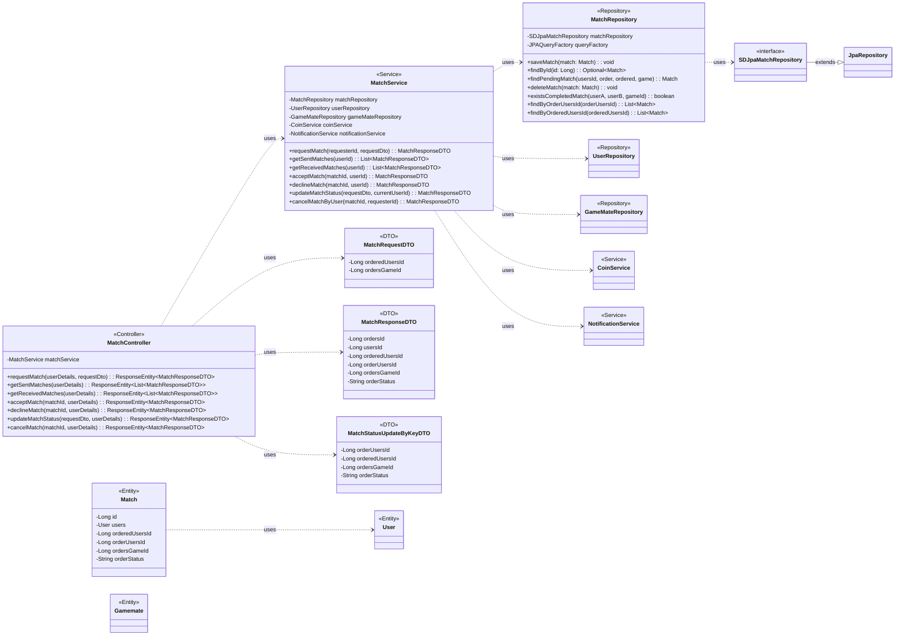

## Match Class Diagram

 

## MatchController 클래스 정보

| 구분             | Name                | Type                               | Visibility | Description                                      |
|:---------------|:--------------------|:-----------------------------------|:-----------|:-------------------------------------------------|
| **class**      | **MatchController** |                                    |            | 매칭 관련 HTTP 요청을 처리하는 REST 컨트롤러           |
| **Attributes** | matchService        | MatchService                       | private    | 매칭 비즈니스 로직을 처리하는 서비스 객체                |
| **Operations** | requestMatch        | ResponseEntity~MatchResponseDTO~   | public     | 새로운 매칭을 요청하는 API 엔드포인트                  |
|                | getSentMatches      | ResponseEntity~List~MatchResponseDTO~~ | public     | 현재 유저가 보낸 매칭 요청 목록을 조회하는 API 엔드포인트 |
|                | getReceivedMatches  | ResponseEntity~List~MatchResponseDTO~~ | public     | 현재 유저가 받은 매칭 요청 목록을 조회하는 API 엔드포인트 |
|                | acceptMatch         | ResponseEntity~MatchResponseDTO~   | public     | 받은 매칭 요청을 수락하는 API 엔드포인트               |
|                | declineMatch        | ResponseEntity~MatchResponseDTO~   | public     | 받은 매칭 요청을 거절하는 API 엔드포인트               |
|                | updateMatchStatus   | ResponseEntity~MatchResponseDTO~   | public     | (사용되지 않음) 키 값으로 매칭 상태를 업데이트하는 API 엔드포인트 |
|                | cancelMatch         | ResponseEntity~MatchResponseDTO~   | public     | 보낸 매칭 요청을 취소하는 API 엔드포인트               |

 

## MatchService 클래스 정보

| 구분             | Name                  | Type                 | Visibility | Description                                                        |
|:---------------|:----------------------|:---------------------|:-----------|:-------------------------------------------------------------------|
| **class**      | **MatchService**      |                      |            | 매칭 관련 비즈니스 로직을 처리하는 서비스 클래스                              |
| **Attributes** | matchRepository       | MatchRepository      | private    | 매칭 정보(Match)에 대한 데이터베이스 연산을 담당하는 리포지토리               |
|                | userRepository        | UserRepository       | private    | 사용자 정보(User)에 대한 데이터베이스 연산을 담당하는 리포지토리                |
|                | gameMateRepository    | GameMateRepository   | private    | 게임메이트 정보(Gamemate)에 대한 데이터베이스 연산을 담당하는 리포지토리      |
|                | coinService           | CoinService          | private    | 코인 관련 비즈니스 로직(사용, 지급, 환불)을 처리하는 서비스                  |
|                | notificationService   | NotificationService  | private    | 알림 관련 비즈니스 로직을 처리하는 서비스                                    |
| **Operations** | requestMatch          | MatchResponseDTO     | public     | 새로운 매칭을 요청하는 비즈니스 로직 (코인 사용, 알림 생성 포함)                |
|                | getSentMatches        | List~MatchResponseDTO~ | public     | 보낸 매칭 요청 목록을 조회하는 비즈니스 로직                               |
|                | getReceivedMatches    | List~MatchResponseDTO~ | public     | 받은 매칭 요청 목록을 조회하는 비즈니스 로직                               |
|                | acceptMatch           | MatchResponseDTO     | public     | 매칭을 수락하는 비즈니스 로직 (코인 지급, 알림 생성 포함)                     |
|                | declineMatch          | MatchResponseDTO     | public     | 매칭을 거절하는 비즈니스 로직 (코인 환불, 알림 생성, 매칭 삭제 포함)              |
|                | updateMatchStatus     | MatchResponseDTO     | public     | (사용되지 않음) 키 값으로 매칭 상태를 업데이트하는 비즈니스 로직               |
|                | cancelMatchByUser     | MatchResponseDTO     | public     | 사용자가 보낸 매칭 요청을 취소하는 비즈니스 로직 (코인 환불, 매칭 삭제 포함)      |

 

## MatchRepository 클래스 정보

| 구분             | Name                    | Type           | Visibility | Description                                            |
|:---------------|:------------------------|:---------------|:-----------|:-------------------------------------------------------|
| **class**      | **MatchRepository**     |                |            | DB에 저장된 매칭 정보를 관리하기 위한 클래스                     |
| **Attributes** | matchRepository         | SDJpaMatchRepository | private    | Spring Data JPA 기능을 사용하기 위함                     |
|                | queryFactory            | JPAQueryFactory  | private    | Query DSL 기능을 사용하기 위한 객체                          |
| **Operations** | saveMatch               | void           | public     | 매칭 정보를 DB에 저장/수정하는 함수                          |
|                | findById                | Optional~Match~ | public     | ID로 특정 매칭 정보를 조회하는 함수                          |
|                | findPendingMatch        | Match          | public     | 요청자, 피요청자, 게임 ID로 대기중인 특정 매칭 정보를 조회하는 함수 |
|                | deleteMatch             | void           | public     | 매칭 정보를 DB에서 삭제하는 함수                             |
|                | existsCompletedMatch    | boolean        | public     | 두 사용자 간에 특정 게임에 대해 완료된 매칭이 있었는지 확인하는 함수 |
|                | findByOrderUsersId      | List~Match~    | public     | 특정 사용자가 보낸 모든 매칭 요청 목록을 조회하는 함수           |
|                | findByOrderedUsersId    | List~Match~    | public     | 특정 사용자에게 온 모든 매칭 요청 목록을 조회하는 함수           |

 

## Match 클래스 정보

| 구분             | Name           | Type   | Visibility | Description                                                |
|:---------------|:---------------|:-------|:-----------|:-----------------------------------------------------------|
| **class**      | **Match**      |        |            | 데이터베이스의 `matches` 테이블과 매핑되는 JPA 엔티티        |
| **Attributes** | id             | Long   | private    | 매칭의 고유 ID (PK)                                          |
|                | users          | User   | private    | 매칭을 요청한 사용자 (FK)                                    |
|                | orderedUsersId | Long   | private    | 매칭 요청을 받은 사용자의 ID                                 |
|                | orderUsersId   | Long   | private    | 매칭을 요청한 사용자의 ID                                    |
|                | ordersGameId   | Long   | private    | 매칭된 게임의 ID                                           |
|                | orderStatus    | String | private    | 매칭의 현재 상태 (e.g., PENDING, ACCEPTED, DECLINED) |

 

## MatchRequestDTO 클래스 정보

| 구분             | Name                | Type | Visibility | Description                     |
|:---------------|:--------------------|:-----|:-----------|:--------------------------------|
| **class**      | **MatchRequestDTO** |      |            | 매칭 요청 DTO                     |
| **Attributes** | orderedUsersId      | Long | private    | 매칭을 요청받을 게임메이트의 사용자 ID |
|                | ordersGameId        | Long | private    | 매칭을 요청할 게임의 ID             |

 

## MatchResponseDTO 클래스 정보

| 구분             | Name                 | Type             | Visibility | Description                                  |
|:---------------|:---------------------|:-----------------|:-----------|:---------------------------------------------|
| **class**      | **MatchResponseDTO** |                  |            | 매칭 정보 응답 DTO                               |
| **Attributes** | ordersId             | Long             | private    | 매칭의 고유 ID                                   |
|                | usersId              | Long             | private    | 매칭을 요청한 사용자의 ID                          |
|                | orderedUsersId       | Long             | private    | 매칭을 요청받은 사용자의 ID                        |
|                | orderUsersId         | Long             | private    | 매칭을 요청한 사용자의 ID                          |
|                | ordersGameId         | Long             | private    | 매칭된 게임의 ID                                 |
|                | orderStatus          | String           | private    | 매칭의 현재 상태                               |
| **Operations** | of                   | MatchResponseDTO | public     | Match 엔티티를 DTO로 변환하는 정적 팩토리 메서드 |

 

## MatchStatusUpdateByKeyDTO 클래스 정보

| 구분             | Name                          | Type   | Visibility | Description                             |
|:---------------|:------------------------------|:-------|:-----------|:----------------------------------------|
| **class**      | **MatchStatusUpdateByKeyDTO** |        |            | (사용되지 않음) 매칭 상태 업데이트 요청 DTO      |
| **Attributes** | orderUsersId                  | Long   | private    | 매칭을 요청한 사용자의 ID                         |
|                | orderedUsersId                | Long   | private    | 매칭을 요청받은 사용자의 ID                   |
|                | ordersGameId                  | Long   | private    | 매칭 요청된 게임의 ID                           |
|                | orderStatus                   | String | private    | 업데이트할 매칭 상태                          |
