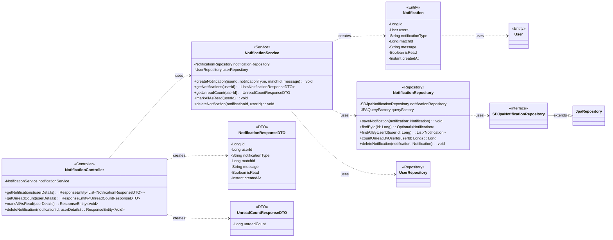

## Notification Class Diagram

 

## NotificationController 클래스 정보

| 구분             | Name                 | Type                                       | Visibility | Description                            |
|:---------------|:---------------------|:-------------------------------------------|:-----------|:---------------------------------------|
| **class**      | **NotificationController** |                                            |            | 알림 관련 HTTP 요청을 처리하는 REST 컨트롤러 |
| **Attributes** | notificationService  | NotificationService                        | private    | 알림 관련 비즈니스 로직을 처리하는 서비스    |
| **Operations** | getNotifications     | ResponseEntity~List~NotificationResponseDTO~~ | public     | 현재 사용자의 모든 알림 목록을 조회하는 API      |
|                | getUnreadCount       | ResponseEntity~UnreadCountResponseDTO~     | public     | 읽지 않은 알림 개수를 조회하는 API           |
|                | markAllAsRead        | ResponseEntity~Void~                       | public     | 모든 알림을 읽음 처리하는 API              |
|                | deleteNotification   | ResponseEntity~Void~                       | public     | 특정 알림을 삭제하는 API                 |

 

## NotificationService 클래스 정보

| 구분             | Name                   | Type                       | Visibility | Description                               |
|:---------------|:-----------------------|:---------------------------|:-----------|:------------------------------------------|
| **class**      | **NotificationService**|                            |            | 알림 관련 비즈니스 로직을 처리하는 서비스 클래스      |
| **Attributes** | notificationRepository | NotificationRepository     | private    | 알림 정보(Notification) DB 작업을 위함        |
|                | userRepository         | UserRepository             | private    | 사용자 정보(User) 조회를 위함                 |
| **Operations** | createNotification     | void                       | public     | 새로운 알림을 생성하는 함수                     |
|                | getNotifications       | List~NotificationResponseDTO~ | public     | 특정 사용자의 모든 알림 목록을 조회하는 함수        |
|                | getUnreadCount         | UnreadCountResponseDTO     | public     | 특정 사용자의 읽지 않은 알림 개수를 조회하는 함수   |
|                | markAllAsRead          | void                       | public     | 특정 사용자의 모든 알림을 읽음 처리하는 함수      |
|                | deleteNotification     | void                       | public     | 특정 알림을 삭제하는 함수                     |

 

## NotificationRepository 클래스 정보

| 구분             | Name                   | Type                      | Visibility | Description                                      |
|:---------------|:-----------------------|:--------------------------|:-----------|:-------------------------------------------------|
| **class**      | **NotificationRepository** |                           |            | DB에 저장된 알림 정보를 관리하기 위한 클래스             |
| **Attributes** | notificationRepository | SDJpaNotificationRepository | private    | Spring Data JPA 기능을 사용하기 위함             |
|                | queryFactory           | JPAQueryFactory           | private    | Query DSL 기능을 사용하기 위한 객체                    |
| **Operations** | saveNotification       | void                      | public     | 알림 정보를 DB에 저장/수정하는 함수                    |
|                | findById               | Optional~Notification~    | public     | ID로 특정 알림 정보를 조회하는 함수                    |
|                | findAllByUserId        | List~Notification~        | public     | 특정 사용자의 모든 알림 목록을 조회하는 함수             |
|                | countUnreadByUserId    | Long                      | public     | 특정 사용자의 읽지 않은 알림 개수를 조회하는 함수        |
|                | deleteNotification     | void                      | public     | 알림 정보를 DB에서 삭제하는 함수                       |

 

## Notification 클래스 정보

| 구분             | Name                 | Type      | Visibility | Description                                      |
|:---------------|:---------------------|:----------|:-----------|:-------------------------------------------------|
| **class**      | **Notification**     |           |            | 데이터베이스의 `notifications` 테이블과 매핑되는 JPA 엔티티 |
| **Attributes** | id                   | Long      | private    | 알림의 고유 ID (PK)                                |
|                | users                | User      | private    | 알림을 수신하는 사용자 (FK)                          |
|                | notificationType     | String    | private    | 알림 종류 (e.g., MATCH_REQUEST)                  |
|                | matchId              | Long      | private    | 알림과 관련된 매칭 ID (선택적)                      |
|                | message              | String    | private    | 알림 메시지 내용                                   |
|                | isRead               | Boolean   | private    | 알림 읽음 여부                                     |
|                | createdAt            | Instant   | private    | 알림 생성 시간                                     |

 

## NotificationResponseDTO 클래스 정보

| 구분             | Name                 | Type    | Visibility | Description       |
|:---------------|:---------------------|:--------|:-----------|:------------------|
| **class**      | **NotificationResponseDTO** | | | 알림 정보 응답 DTO |
| **Attributes** | id                   | Long    | private    | 알림 ID           |
|                | userId               | Long    | private    | 사용자 ID         |
|                | notificationType     | String  | private    | 알림 종류         |
|                | matchId              | Long    | private    | 관련 매칭 ID      |
|                | message              | String  | private    | 메시지 내용       |
|                | isRead               | Boolean | private    | 읽음 여부         |
|                | createdAt            | Instant | private    | 생성 시간         |
| **Operations** | fromEntity           | NotificationResponseDTO | public | Notification 엔티티를 DTO로 변환하는 정적 팩토리 메서드 |

 

## UnreadCountResponseDTO 클래스 정보

| 구분             | Name                   | Type | Visibility | Description          |
|:---------------|:-----------------------|:-----|:-----------|:---------------------|
| **class**      | **UnreadCountResponseDTO** | | | 읽지 않은 알림 개수 응답 DTO |
| **Attributes** | unreadCount            | Long | private    | 읽지 않은 알림의 총 개수 |
