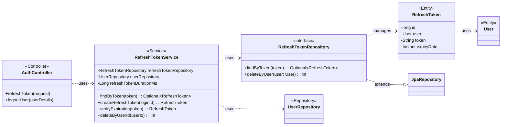

## Refresh Token Class Diagram

 

## RefreshTokenService 클래스 정보

| 구분             | Name                    | Type                   | Visibility | Description                                      |
|:---------------|:------------------------|:-----------------------|:-----------|:-------------------------------------------------|
| **class**      | **RefreshTokenService** |                        |            | 리프레시 토큰의 생성, 조회, 검증, 삭제를 담당하는 서비스 클래스 |
| **Attributes** | refreshTokenRepository  | RefreshTokenRepository | private    | 리프레시 토큰 DB 작업을 위함                       |
|                | userRepository          | UserRepository         | private    | 사용자 정보 조회를 위함                              |
|                | refreshTokenDurationMs  | Long                   | private    | 리프레시 토큰의 만료 시간을 (ms) 설정하기 위함       |
| **Operations** | findByToken             | Optional~RefreshToken~ | public     | 토큰 문자열로 리프레시 토큰 객체를 조회              |
|                | createRefreshToken      | RefreshToken           | public     | 특정 사용자에 대한 리프레시 토큰을 생성 (기존 토큰 삭제 후) |
|                | verifyExpiration        | RefreshToken           | public     | 토큰의 만료 시간을 검증 (만료 시 예외 발생 및 DB에서 삭제) |
|                | deleteByUserId          | int                    | public     | 특정 사용자의 리프레시 토큰을 DB에서 삭제              |

 

## RefreshTokenRepository 인터페이스 정보

| 구분             | Name                  | Type                   | Visibility | Description                            |
|:---------------|:----------------------|:-----------------------|:-----------|:---------------------------------------|
| **interface**  | **RefreshTokenRepository** |                        |            | Spring Data JPA를 사용하여 리프레시 토큰 DB 작업을 처리하는 인터페이스 |
| **Attributes** |                       |                        |            |                                        |
| **Operations** | findByToken           | Optional~RefreshToken~ | public     | `token` 필드로 리프레시 토큰을 조회      |
|                | deleteByUser          | int                    | public     | `User` 엔티티로 리프레시 토큰을 삭제       |

 

## RefreshToken 클래스 정보

| 구분             | Name         | Type    | Visibility | Description                          |
|:---------------|:-------------|:--------|:-----------|:-------------------------------------|
| **class**      | **RefreshToken** |         |            | 데이터베이스의 `refresh_tokens` 테이블과 매핑되는 JPA 엔티티 |
| **Attributes** | id           | long    | private    | 리프레시 토큰의 고유 ID (PK)               |
|                | user         | User    | private    | 토큰에 연결된 사용자 (FK)                  |
|                | token        | String  | private    | UUID로 생성된 토큰 문자열                |
|                | expiryDate   | Instant | private    | 토큰 만료 시간                         |
