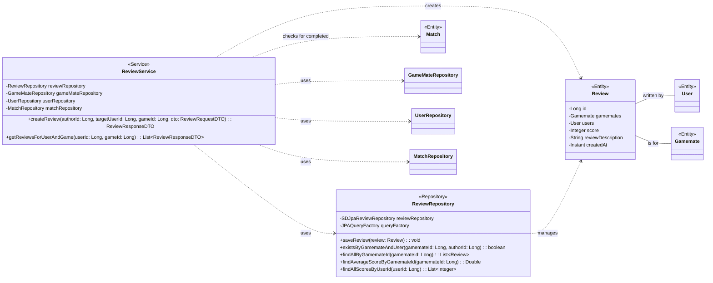

## Review Class Diagram

 

## ReviewService 클래스 정보

| 구분             | Name                       | Type                    | Visibility | Description                               |
|:---------------|:---------------------------|:------------------------|:-----------|:------------------------------------------|
| **class**      | **ReviewService**          |                         |            | 리뷰 관련 비즈니스 로직을 처리하는 서비스 클래스      |
| **Attributes** | reviewRepository           | ReviewRepository        | private    | 리뷰 정보 DB 작업을 위함                        |
|                | gameMateRepository         | GameMateRepository      | private    | 게임메이트 정보 조회를 위함                     |
|                | userRepository             | UserRepository          | private    | 유저 정보 조회를 위함                         |
|                | matchRepository            | MatchRepository         | private    | 매칭 완료 여부 확인을 위함                      |
| **Operations** | createReview               | ReviewResponseDTO       | public     | 유효성 검사 후 리뷰를 생성하는 함수             |
|                | getReviewsForUserAndGame   | List<ReviewResponseDTO> | public     | 특정 유저의 특정 게임에 대한 리뷰 목록을 조회하는 함수 |

 

## ReviewRepository 클래스 정보

| 구분             | Name                         | Type           | Visibility | Description                                               |
|:---------------|:-----------------------------|:---------------|:-----------|:----------------------------------------------------------|
| **class**      | **ReviewRepository**         |                |            | 리뷰 관련 데이터를 DB에서 조회/수정/삭제하기 위한 클래스          |
| **Attributes** | reviewRepository             | SDJpaReviewRepository | private    | Spring Data JPA 기능을 사용하기 위함                        |
|                | em                           | EntityManager  | private    | 엔티티 객체를 관리해주는 객체                               |
|                | queryFactory                 | JPAQueryFactory| private    | Query DSL 기능을 사용하기 위한 객체                         |
| **Operations** | ReviewRepository             | void           | public     | ReviewRepository 클래스 생성 및 초기화하는 생성자             |
|                | saveReview                   | void           | public     | 리뷰 정보를 DB에 저장하는 함수                              |
|                | updateReview                 | void           | public     | 리뷰 정보를 수정하는 함수                                   |
|                | deleteReview                 | void           | public     | 리뷰 정보를 삭제하는 함수                                   |
|                | existsByGamemateAndUser      | boolean        | public     | 특정 유저가 특정 게임메이트에게 이미 리뷰를 남겼는지 확인하는 함수 |
|                | findAllByGamemateId          | List<Review>   | public     | 특정 게임메이트에 대한 모든 리뷰를 조회하는 함수                |
|                | findAverageScoreByGamemateId | Double         | public     | 특정 게임메이트의 평균 점수를 계산하는 함수                   |
|                | findAllScoresByUserId        | List<Integer>  | public     | 특정 유저가 받은 모든 리뷰 점수를 조회하는 함수               |
