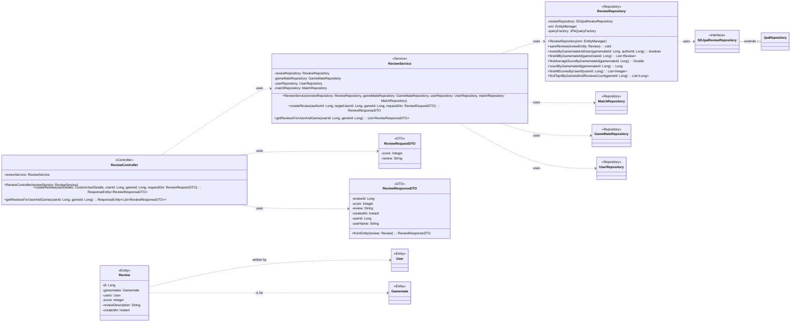

## Review Class Diagram

 

## ReviewController 클래스 정보

| 구분             | Name                       | Type                                     | Visibility | Description                                      |

|:---------------|:---------------------------|:-----------------------------------------|:-----------|:-------------------------------------------------|

| **class**      | **ReviewController**       |                                          |            | 리뷰 관련 HTTP 요청을 처리하는 REST 컨트롤러           |

| **Attributes** | reviewService              | ReviewService                            | private    | 리뷰 관련 비즈니스 로직을 처리하는 서비스                |

| **Operations** | ReviewController           | void                                     | public     | 생성자 (Lombok @RequiredArgsConstructor)         |

|                | createReview               | ResponseEntity~ReviewResponseDTO~        | public     | 특정 게임메이트의 특정 게임에 대한 리뷰를 생성하는 API (`POST`) |

|                | getReviewsForUserAndGame   | ResponseEntity~List~ReviewResponseDTO~~  | public     | 특정 게임메이트의 특정 게임에 대한 모든 리뷰를 조회하는 API (`GET`) |

 

## ReviewService 클래스 정보

| 구분             | Name                       | Type                    | Visibility | Description                               |

|:---------------|:---------------------------|:------------------------|:-----------|:------------------------------------------|

| **class**      | **ReviewService**          |                         |            | 리뷰 관련 비즈니스 로직을 처리하는 서비스 클래스      |

| **Attributes** | reviewRepository           | ReviewRepository        | private    | 리뷰 정보(Review) DB 작업을 위함                |

|                | gameMateRepository         | GameMateRepository      | private    | 게임메이트 정보(Gamemate) 조회를 위함             |

|                | userRepository             | UserRepository          | private    | 유저 정보(User) 조회를 위함                   |

|                | matchRepository            | MatchRepository         | private    | 매칭 완료(Match) 여부 확인을 위함               |

| **Operations** | ReviewService              | void                    | public     | 생성자 (Lombok @RequiredArgsConstructor) |

|                | createReview               | ReviewResponseDTO       | public     | 유효성 검사 후 리뷰를 생성하는 함수             |

|                | getReviewsForUserAndGame   | List~ReviewResponseDTO~ | public     | 특정 유저의 특정 게임에 대한 리뷰 목록을 조회하는 함수 |

 

## ReviewRepository 클래스 정보

| 구분             | Name                               | Type           | Visibility | Description                                               |

|:---------------|:-----------------------------------|:---------------|:-----------|:----------------------------------------------------------|

| **class**      | **ReviewRepository**               |                |            | 리뷰 관련 데이터를 DB에서 관리하기 위한 클래스                  |

| **Attributes** | reviewRepository                   | SDJpaReviewRepository | private    | Spring Data JPA 기능을 사용하기 위함                        |

|                | em                                 | EntityManager  | private    | 엔티티 객체를 관리해주는 객체                               |

|                | queryFactory                       | JPAQueryFactory| private    | Query DSL 기능을 사용하기 위한 객체                         |

| **Operations** | ReviewRepository                   | void           | public     | 생성자                                                  |

|                | saveReview                         | void           | public     | 리뷰 정보를 DB에 저장하는 함수                              |

|                | existsByGamemateAndUser            | boolean        | public     | 특정 유저가 특정 게임메이트에게 이미 리뷰를 남겼는지 확인하는 함수 |

|                | findAllByGamemateId                | List~Review~   | public     | 특정 게임메이트에 대한 모든 리뷰를 조회하는 함수                |

|                | findAverageScoreByGamemateId       | Double         | public     | 특정 게임메이트의 평균 점수를 계산하는 함수                   |

|                | countByGamemateId                  | Long           | public     | 특정 게임메이트의 리뷰 개수를 계산하는 함수                   |

|                | findAllScoresByUserId              | List~Integer~  | public     | 특정 유저가 받은 모든 리뷰 점수를 조회하는 함수               |

|                | findTop4ByGameIdAndReviewsCount    | List~Long~     | public     | 특정 게임에서 리뷰 수가 가장 많은 상위 4명 게임메이트 ID를 조회하는 함수 |

 

## Review 클래스 정보

| 구분             | Name                | Type    | Visibility | Description                                      |

|:---------------|:--------------------|:--------|:-----------|:-------------------------------------------------|

| **class**      | **Review**          |         |            | 데이터베이스의 `reviews` 테이블과 매핑되는 JPA 엔티티     |

| **Attributes** | id                  | Long    | private    | 리뷰의 고유 ID (PK)                                |

|                | gamemates           | Gamemate| private    | 리뷰 대상 게임메이트 (FK)                            |

|                | users               | User    | private    | 리뷰 작성자 (FK)                                   |

|                | score               | Integer | private    | 평점 (1-5)                                       |

|                | reviewDescription   | String  | private    | 리뷰 내용                                        |

|                | createdAt           | Instant | private    | 리뷰 생성 시간                                     |

 

## ReviewRequestDTO 클래스 정보

| 구분             | Name           | Type    | Visibility | Description     |

|:---------------|:---------------|:--------|:-----------|:----------------|

| **class**      | **ReviewRequestDTO** | | | 리뷰 생성 요청 DTO |

| **Attributes** | score          | Integer | private    | 평점 (1-5)      |

|                | review         | String  | private    | 리뷰 내용       |

 

## ReviewResponseDTO 클래스 정보

| 구분             | Name           | Type    | Visibility | Description       |

|:---------------|:---------------|:--------|:-----------|:------------------|

| **class**      | **ReviewResponseDTO** | | | 리뷰 정보 응답 DTO |

| **Attributes** | reviewId       | Long    | private    | 리뷰 ID           |

|                | score          | Integer | private    | 평점              |

|                | review         | String  | private    | 리뷰 내용         |

|                | createdAt      | Instant | private    | 리뷰 생성 시간    |

|                | userId         | Long    | private    | 리뷰 작성자 ID    |

|                | userName       | String  | private    | 리뷰 작성자 이름  |

| **Operations** | fromEntity     | ReviewResponseDTO | public     | Review 엔티티를 DTO로 변환하는 정적 팩토리 메서드 |
