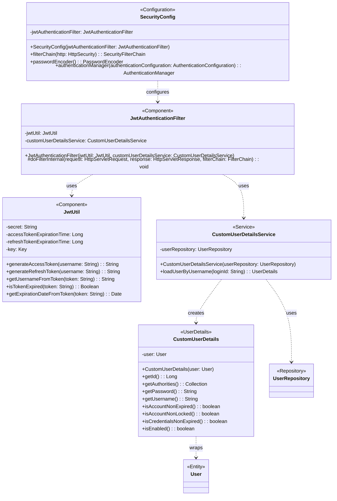

## Security & JWT Class Diagram

 

## SecurityConfig 클래스 정보

| 구분             | Name                  | Type                        | Visibility | Description                                      |
|:---------------|:----------------------|:----------------------------|:-----------|:-------------------------------------------------|
| **class**      | **SecurityConfig**    |                             |            | Spring Security 관련 설정을 담당하는 클래스            |
| **Attributes** | jwtAuthenticationFilter | JwtAuthenticationFilter     | private    | 모든 요청에 대해 JWT 토큰을 검증하는 커스텀 필터         |
| **Operations** | SecurityConfig        | void                        | public     | 생성자 (Lombok @RequiredArgsConstructor)         |
|                | filterChain           | SecurityFilterChain         | public     | HTTP 보안 설정을 정의 (e.g., CSRF 비활성화, 세션 관리, 인가 규칙, 필터 추가) |
|                | passwordEncoder       | PasswordEncoder             | public     | 비밀번호 암호화를 위한 `BCryptPasswordEncoder`를 Bean으로 등록 |
|                | authenticationManager | AuthenticationManager       | public     | 인증을 처리하는 `AuthenticationManager`를 Bean으로 등록 |

 

## JwtAuthenticationFilter 클래스 정보

| 구분             | Name                     | Type                     | Visibility | Description                                      |
|:---------------|:-------------------------|:-------------------------|:-----------|:-------------------------------------------------|
| **class**      | **JwtAuthenticationFilter** |                            |            | 요청 헤더의 JWT 토큰을 검증하고, 유효하면 SecurityContext에 인증 정보를 설정하는 필터 |
| **Attributes** | jwtUtil                  | JwtUtil                  | private    | JWT 토큰 생성, 검증 등 유틸리티                        |
|                | customUserDetailsService | CustomUserDetailsService | private    | 사용자 정보를 DB에서 로드하는 서비스                   |
| **Operations** | JwtAuthenticationFilter  | void                     | public     | 생성자 (Lombok @RequiredArgsConstructor)         |
|                | doFilterInternal         | void                     | protected  | 실제 필터링 로직을 수행하는 메서드                       |

 

## JwtUtil 클래스 정보

| 구분             | Name                        | Type     | Visibility | Description                            |
|:---------------|:----------------------------|:---------|:-----------|:---------------------------------------|
| **class**      | **JwtUtil**                 |          |            | JWT 관련 작업을 처리하는 유틸리티 클래스         |
| **Attributes** | secret                      | String   | private    | JWT 서명에 사용되는 비밀 키 (설정값 주입)      |
|                | accessTokenExpirationTime   | Long     | private    | 액세스 토큰의 만료 시간 (설정값 주입)          |
|                | refreshTokenExpirationTime  | Long     | private    | 리프레시 토큰의 만료 시간 (설정값 주입)        |
|                | key                         | Key      | private    | 서명에 사용될 키 객체                          |
| **Operations** | generateAccessToken         | String   | public     | 사용자 이름을 기반으로 새로운 액세스 토큰을 생성 |
|                | generateRefreshToken        | String   | public     | 사용자 이름을 기반으로 새로운 리프레시 토큰을 생성 |
|                | getUsernameFromToken        | String   | public     | 토큰에서 사용자 이름을 추출                  |
|                | isTokenExpired              | Boolean  | public     | 토큰이 만료되었는지 확인                     |
|                | getExpirationDateFromToken  | Date     | public     | 토큰에서 만료 날짜를 추출                    |

 

## CustomUserDetailsService 클래스 정보

| 구분             | Name                   | Type             | Visibility | Description                                      |
|:---------------|:-----------------------|:-----------------|:-----------|:-------------------------------------------------|
| **class**      | **CustomUserDetailsService** |                  |            | Spring Security의 `UserDetailsService`를 구현한 클래스 |
| **Attributes** | userRepository         | UserRepository   | private    | DB에서 사용자 정보를 조회하기 위한 리포지토리          |
| **Operations** | CustomUserDetailsService | void             | public     | 생성자 (Lombok @RequiredArgsConstructor)         |
|                | loadUserByUsername     | UserDetails      | public     | 사용자 이름(loginId)으로 DB에서 `UserDetails` 객체를 로드 |

 

## CustomUserDetails 클래스 정보

| 구분             | Name                      | Type         | Visibility | Description                                      |
|:---------------|:--------------------------|:-------------|:-----------|:-------------------------------------------------|
| **class**      | **CustomUserDetails**     |              |            | Spring Security의 `UserDetails`를 구현한 클래스      |
| **Attributes** | user                      | User         | private    | 애플리케이션의 `User` 도메인 객체                    |
| **Operations** | CustomUserDetails         | void         | public     | 생성자                                         |
|                | getId                     | Long         | public     | 사용자의 고유 ID를 반환                            |
|                | getAuthorities            | Collection   | public     | 사용자의 권한 목록을 반환                            |
|                | getPassword               | String       | public     | 사용자의 비밀번호를 반환                             |
|                | getUsername               | String       | public     | 사용자의 아이디를 반환                               |
|                | isAccountNonExpired       | boolean      | public     | 계정 만료 여부를 반환                          |
|                | isAccountNonLocked        | boolean      | public     | 계정 잠김 여부를 반환                          |
|                | isCredentialsNonExpired   | boolean      | public     | 자격 증명 만료 여부를 반환                     |
|                | isEnabled                 | boolean      | public     | 계정 활성화 여부를 반환                        |
