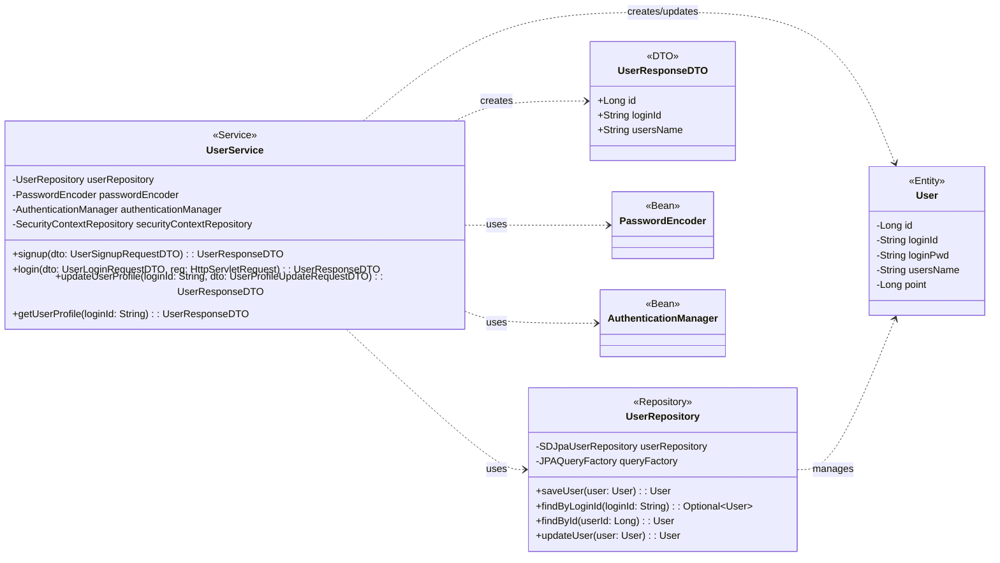

## User Class Diagram

 

## UserService 클래스 정보

| 구분             | Name                      | Type                        | Visibility | Description                               |
|:---------------|:--------------------------|:----------------------------|:-----------|:------------------------------------------|
| **class**      | **UserService**           |                             |            | 사용자 관련 비즈니스 로직을 처리하는 서비스 클래스      |
| **Attributes** | userRepository            | UserRepository              | private    | 유저 정보 DB 작업을 위함                        |
|                | passwordEncoder           | PasswordEncoder             | private    | 비밀번호 암호화를 위함                          |
|                | authenticationManager     | AuthenticationManager       | private    | Spring Security를 통한 사용자 인증을 위함       |
|                | securityContextRepository | SecurityContextRepository   | private    | 인증된 사용자의 보안 컨텍스트(세션) 저장을 위함   |
| **Operations** | signup                    | UserResponseDTO             | public     | 회원가입 로직을 처리하는 함수                   |
|                | login                     | UserResponseDTO             | public     | 로그인 로직을 처리하고 세션을 생성하는 함수       |
|                | updateUserProfile         | UserResponseDTO             | public     | 사용자 프로필 정보를 수정하는 함수                |
|                | getUserProfile            | UserResponseDTO             | public     | 사용자 프로필 정보를 조회하는 함수                |

 

## UserRepository 클래스 정보

| 구분             | Name            | Type                  | Visibility | Description                               |
|:---------------|:----------------|:----------------------|:-----------|:------------------------------------------|
| **class**      | **UserRepository** |                       |            | 유저 관련 데이터를 DB에서 조회/수정/삭제하기 위한 클래스 |
| **Attributes** | userRepository  | SDJpaUserRepository   | private    | Spring Data JPA 기능을 사용하기 위함            |
|                | em              | EntityManager         | private    | 엔티티 객체를 관리해주는 객체                   |
|                | queryFactory    | JPAQueryFactory       | private    | Query DSL 기능을 사용하기 위한 객체             |
| **Operations** | UserRepository  | void                  | public     | UserRepository 클래스 생성 및 초기화하는 생성자   |
|                | saveUser        | User                  | public     | 유저 정보를 DB에 저장/수정하는 함수             |
|                | findByLoginId   | Optional<User>        | public     | `loginId`로 특정 유저 정보를 조회하는 함수      |
|                | findById        | User                  | public     | `userId`로 특정 유저 정보를 조회하는 함수       |
|                | updateUser      | User                  | public     | 유저 정보를 수정하는 함수                       |
