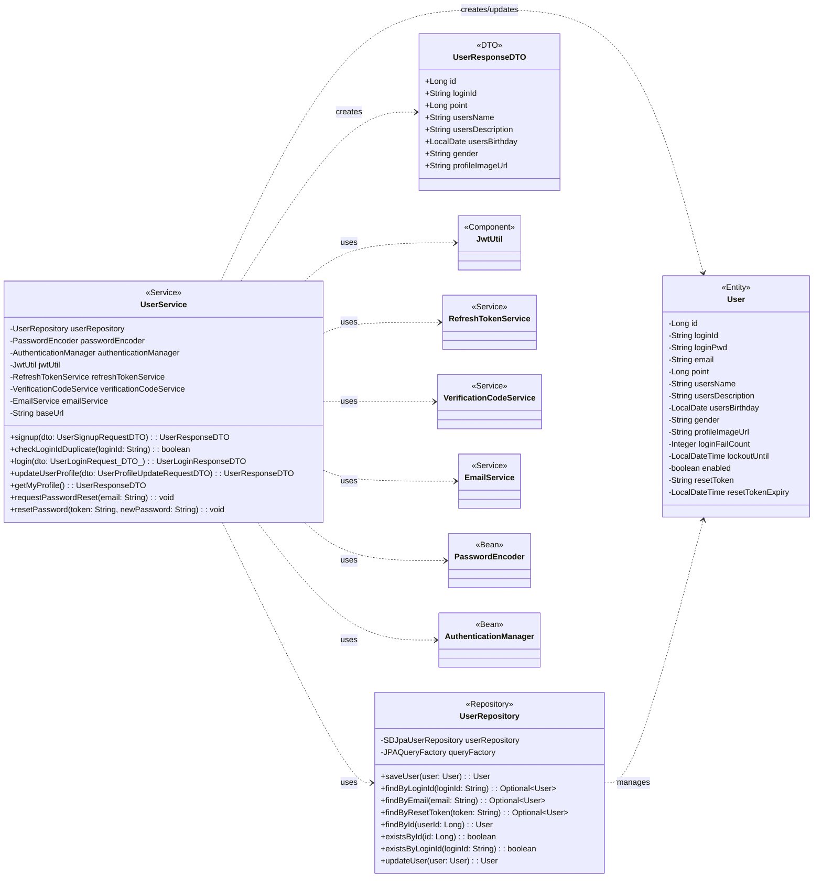

## User Class Diagram

 

## UserService 클래스 정보

| 구분             | Name                      | Type                   | Visibility | Description                                      |
|:---------------|:--------------------------|:-----------------------|:-----------|:-------------------------------------------------|
| **class**      | **UserService**           |                        |            | 사용자 관련 비즈니스 로직을 처리하는 서비스 클래스             |
| **Attributes** | userRepository            | UserRepository         | private    | 유저 정보 DB 작업을 위함                               |
|                | passwordEncoder           | PasswordEncoder        | private    | 비밀번호 암호화를 위함                                 |
|                | authenticationManager     | AuthenticationManager  | private    | Spring Security를 통한 사용자 인증을 위함              |
|                | jwtUtil                   | JwtUtil                | private    | JWT 토큰 생성 및 검증을 위함                           |
|                | refreshTokenService       | RefreshTokenService    | private    | Refresh 토큰 관련 로직 처리를 위함                     |
|                | verificationCodeService   | VerificationCodeService| private    | 이메일 인증 코드 관련 로직 처리를 위함                   |
|                | emailService              | EmailService           | private    | 이메일 발송을 위함                                   |
|                | baseUrl                   | String                 | private    | 애플리케이션 기본 URL                                |
| **Operations** | signup                    | UserResponseDTO        | public     | 회원가입 로직을 처리하는 함수                          |
|                | checkLoginIdDuplicate     | boolean                | public     | 아이디 중복 여부를 확인하는 함수                       |
|                | login                     | UserLoginResponseDTO   | public     | 로그인 로직을 처리하고 JWT 토큰을 발급하는 함수        |
|                | updateUserProfile         | UserResponseDTO        | public     | 현재 로그인된 사용자의 프로필 정보를 수정하는 함수         |
|                | getMyProfile              | UserResponseDTO        | public     | 현재 로그인된 사용자의 프로필 정보를 조회하는 함수         |
|                | requestPasswordReset      | void                   | public     | 비밀번호 재설정 이메일 발송을 요청하는 함수              |
|                | resetPassword             | void                   | public     | 이메일 링크를 통해 비밀번호를 재설정하는 함수            |

 

## UserRepository 클래스 정보

| 구분             | Name                      | Type                  | Visibility | Description                                      |
|:---------------|:--------------------------|:----------------------|:-----------|:-------------------------------------------------|
| **class**      | **UserRepository**        |                       |            | 유저 관련 데이터를 DB에서 조회/수정/삭제하기 위한 클래스        |
| **Attributes** | userRepository            | SDJpaUserRepository   | private    | Spring Data JPA 기능을 사용하기 위함                   |
|                | em                        | EntityManager         | private    | 엔티티 객체를 관리해주는 객체                          |
|                | queryFactory              | JPAQueryFactory       | private    | Query DSL 기능을 사용하기 위한 객체                    |
| **Operations** | UserRepository            | void                  | public     | UserRepository 클래스 생성 및 초기화하는 생성자          |
|                | saveUser                  | User                  | public     | 유저 정보를 DB에 저장하는 함수                         |
|                | findByLoginId             | Optional<User>        | public     | `loginId`로 특정 유저 정보를 조회하는 함수             |
|                | findByEmail               | Optional<User>        | public     | `email`로 특정 유저 정보를 조회하는 함수               |
|                | findByResetToken          | Optional<User>        | public     | `resetToken`으로 특정 유저 정보를 조회하는 함수        |
|                | findById                  | User                  | public     | `userId`로 특정 유저 정보를 조회하는 함수              |
|                | existsById                | boolean               | public     | `id`로 특정 유저의 존재 여부를 확인하는 함수           |
|                | existsByLoginId           | boolean               | public     | `loginId`로 특정 유저의 존재 여부를 확인하는 함수      |
|                | updateUser                | User                  | public     | 유저 정보를 수정하는 함수                            |
|                | incrementLoginFailCount   | void                  | public     | 로그인 실패 횟수를 증가시키는 함수                     |
|                | resetLoginFailCount       | void                  | public     | 로그인 실패 횟수를 초기화하는 함수                     |