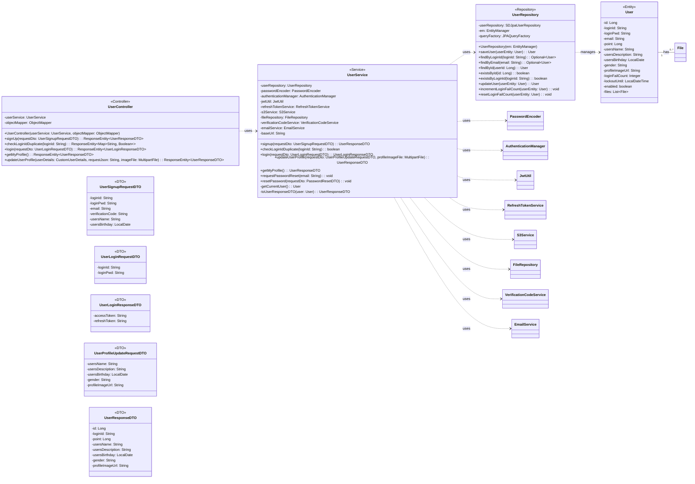

## User Class Diagram

 

## UserController 클래스 정보

| 구분 | Name | Type | Visibility | Description |
|---|---|---|---|---|
| **class** | **UserController** | | | 사용자 관련 HTTP 요청을 처리하는 REST 컨트롤러 |
| **Attributes** | userService | UserService | private | 사용자 관련 비즈니스 로직을 처리하는 서비스 |
| | objectMapper | ObjectMapper | private | JSON 문자열과 DTO 객체 간 변환을 위함 |
| **Operations** | UserController | void | public | 생성자 |
| | signUp | ResponseEntity~UserResponseDTO~ | public | 사용자 회원가입 API |
| | checkLoginIdDuplicate | ResponseEntity~Map~String, Boolean~~ | public | 아이디 중복 확인 API |
| | login | ResponseEntity~UserLoginResponseDTO~ | public | 사용자 로그인 API |
| | getMyProfile | ResponseEntity~UserResponseDTO~ | public | 현재 로그인된 사용자 정보 조회 API |
| | updateUserProfile | ResponseEntity~UserResponseDTO~ | public | 현재 로그인된 사용자 정보 수정 API |

 

## UserService 클래스 정보

| 구분 | Name | Type | Visibility | Description |
|---|---|---|---|---|
| **class** | **UserService** | | | 사용자 관련 비즈니스 로직을 처리하는 서비스 클래스 |
| **Attributes** | userRepository | UserRepository | private | 유저 정보 DB 작업을 위함 |
| | passwordEncoder | PasswordEncoder | private | 비밀번호 암호화를 위함 |
| | ... (many dependencies) | ... | private | ... |
| **Operations** | signup | UserResponseDTO | public | 회원가입 로직을 처리하는 함수 |
| | checkLoginIdDuplicate | boolean | public | 아이디 중복 여부를 확인하는 함수 |
| | login | UserLoginResponseDTO | public | 로그인 로직을 처리하고 JWT 토큰을 발급하는 함수 |
| | updateUserProfile | UserResponseDTO | public | 현재 로그인된 사용자의 프로필 정보를 수정하는 함수 |
| | getMyProfile | UserResponseDTO | public | 현재 로그인된 사용자의 프로필 정보를 조회하는 함수 |
| | requestPasswordReset | void | public | 비밀번호 재설정 이메일 발송을 요청하는 함수 |
| | resetPassword | void | public | 인증 코드를 통해 비밀번호를 재설정하는 함수 |
| | getCurrentUser | User | private | SecurityContext에서 현재 사용자 엔티티를 가져오는 함수 |
| | toUserResponseDTO | UserResponseDTO | private | User 엔티티를 UserResponseDTO로 변환하는 함수 |

 

## UserRepository 클래스 정보

| 구분 | Name | Type | Visibility | Description |
|---|---|---|---|---|
| **class** | **UserRepository** | | | 유저 관련 데이터를 DB에서 조회/수정/삭제하기 위한 클래스 |
| **Attributes** | userRepository | SDJpaUserRepository | private | Spring Data JPA 기능을 사용하기 위함 |
| | em | EntityManager | private | 엔티티 객체를 관리해주는 객체 |
| | queryFactory | JPAQueryFactory | private | Query DSL 기능을 사용하기 위한 객체 |
| **Operations** | UserRepository | void | public | 생성자 |
| | saveUser | User | public | 유저 정보를 DB에 저장/수정하는 함수 |
| | findByLoginId | Optional~User~ | public | `loginId`로 특정 유저 정보를 조회하는 함수 |
| | findByEmail | Optional~User~ | public | `email`로 특정 유저 정보를 조회하는 함수 |
| | findById | User | public | `userId`로 특정 유저 정보를 조회하는 함수 |
| | existsByLoginId | boolean | public | `loginId`로 특정 유저의 존재 여부를 확인하는 함수 |
| | incrementLoginFailCount | void | public | 로그인 실패 횟수를 증가시키는 함수 |
| | resetLoginFailCount | void | public | 로그인 실패 횟수를 초기화하는 함수 |

 

## User 클래스 정보

| 구분 | Name | Type | Visibility | Description |
|---|---|---|---|---|
| **class** | **User** | | | 데이터베이스의 `users` 테이블과 매핑되는 JPA 엔티티 |
| **Attributes** | id | Long | private | 사용자의 고유 ID (PK) |
| | loginId | String | private | 로그인 아이디 |
| | loginPwd | String | private | 로그인 비밀번호 |
| | email | String | private | 이메일 주소 |
| | point | Long | private | 보유 포인트 |
| | usersName | String | private | 사용자 이름 |
| | usersDescription | String | private | 자기소개 |
| | usersBirthday | LocalDate | private | 생년월일 |
| | gender | String | private | 성별 |
| | profileImageUrl | String | private | 프로필 이미지 URL |
| | loginFailCount | Integer | private | 로그인 연속 실패 횟수 |
| | lockoutUntil | LocalDateTime | private | 계정 잠금 만료 시간 |
| | enabled | boolean | private | 계정 활성화 여부 |
| | files | List~File~ | private | 사용자가 업로드한 파일 목록 |

 

*(The file continues with DTO definitions which are now accurately represented in the Mermaid diagram above.)*