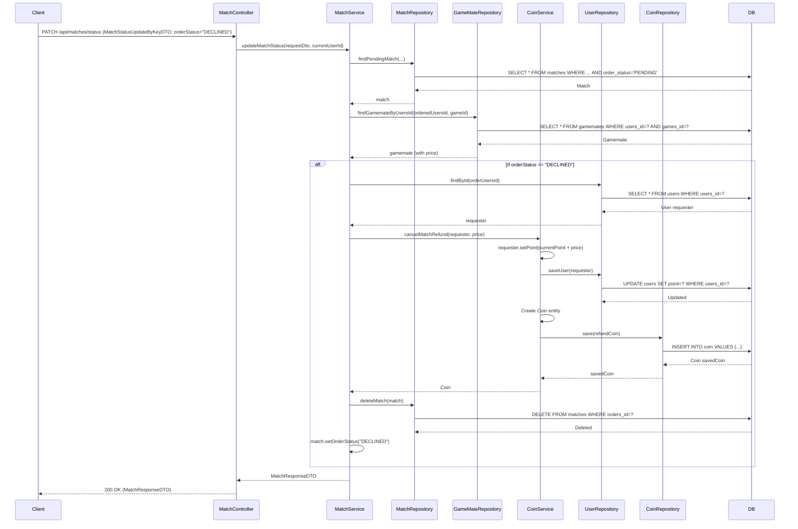

## Cancel Match Refund Sequence Diagram

## 매칭 취소/거절 시 코인 환불 (내부 메서드)

| 항목 | 흐름 요약 | 핵심 비즈니스 로직 |
|:---|:---|:---|
| **목표** | 매칭 취소 또는 거절 시 요청자에게 코인을 환불하고 거래 내역 기록 | - |
| **호출 시점 1** | `MatchService.updateMatchStatus()`에서 게임메이트가 매칭을 **DECLINED**로 변경할 때 호출됩니다. | **게임메이트 거절** |
| **호출 시점 2** | `MatchService.cancelMatchByUser()`에서 요청자가 **PENDING 상태의 매칭을 취소**할 때 호출됩니다. | **요청자 취소** |
| **포인트 환불** | `CoinService.cancelMatchRefund()`는 요청자의 **point를 매칭 가격만큼 증가**시키고 `UserRepository`를 통해 **UPDATE**를 요청합니다. | **포인트 환불** |
| **거래 기록** | `Service`는 `Coin` 엔티티를 생성하여 **환불 내역을 DB에 INSERT**합니다. | **거래 이력 저장** (coinAmount: 양수, paymentMethod: "MATCH_CANCELLED") |
| **매칭 삭제** | `MatchService`는 **매칭 레코드를 DB에서 DELETE**합니다. | 매칭 기록 삭제 |