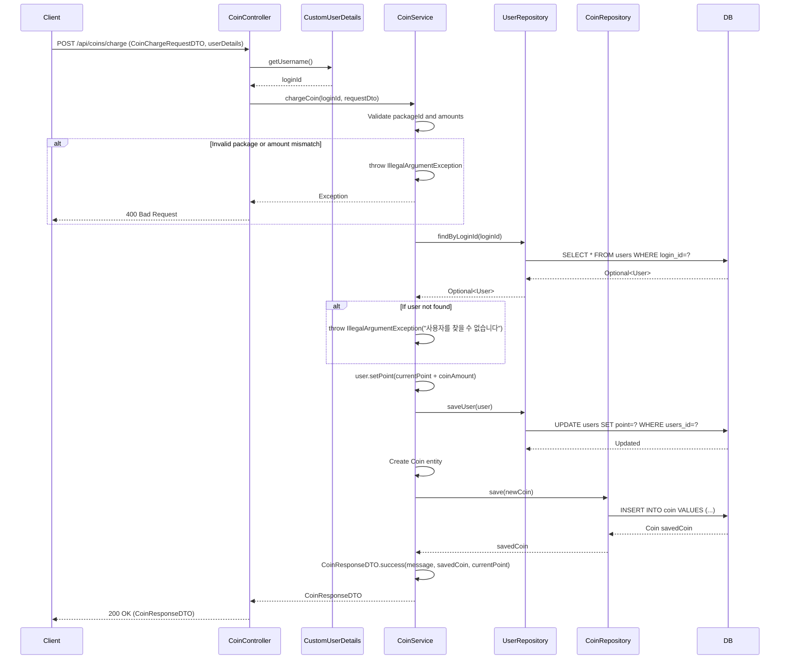

## Charge Coin Sequence Diagram

## 코인 충전 (POST `/api/coins/charge`)

| 항목 | 흐름 요약 | 핵심 비즈니스 로직 |
|:---|:---|:---|
| **목표** | 사용자 코인 충전 및 거래 내역 기록 | - |
| **요청 수신 및 인증** | `Client`가 충전 정보를 전달하면 `Controller`는 `CustomUserDetails`를 통해 **인증된 사용자를 식별**합니다. | - |
| **패키지 검증** | `CoinService`는 `COIN_PACKAGES` Map에서 `packageId`(1-5)가 **유효한지** 확인하고, 요청한 **coinAmount와 paymentAmount가 패키지 정보와 일치하는지** 검증합니다. | **패키지 정보 검증** (예외 처리) |
| **사용자 조회** | `Service`는 `UserRepository`의 `findByLoginId`를 통해 **loginId로 사용자를 조회**합니다. | 사용자 존재 확인 (예외 처리) |
| **포인트 증가** | `Service`는 사용자의 **point를 충전 금액만큼 증가**시키고 `UserRepository`를 통해 **UPDATE**를 요청합니다. | **포인트 업데이트** |
| **거래 기록** | `Service`는 `Coin` 엔티티를 생성하여 `CoinRepository`를 통해 **충전 내역을 DB에 INSERT**합니다. | **거래 이력 저장** (coinAmount: 양수, paymentMethod: "CHARGE") |
| **응답 반환** | `Service`는 거래 정보와 현재 잔액을 DTO로 변환하여 `Controller`를 거쳐 `Client`에게 **HTTP 200 OK** 응답과 함께 반환합니다. | - |

**코인 패키지 정보:**
| packageId | coinAmount | paymentAmount |
|:---:|:---:|:---:|
| 1 | 500 | 4,680원 |
| 2 | 1,000 | 9,360원 |
| 3 | 2,000 | 18,720원 |
| 4 | 5,000 | 45,600원 |
| 5 | 10,000 | 91,200원 |