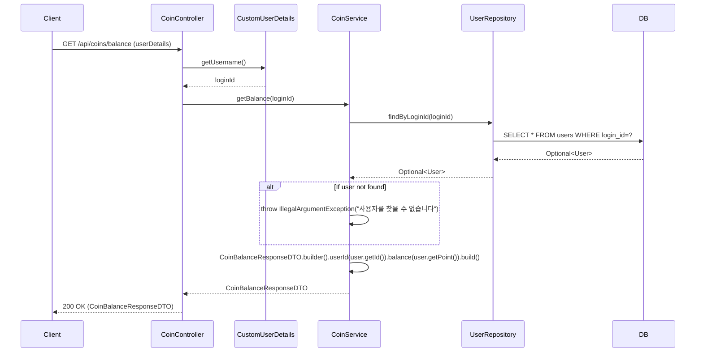

## Coin Balance Sequence Diagram

---

## 코인 잔액 조회 (GET `/api/coins/balance`)

| 항목 | 흐름 요약 | 핵심 비즈니스 로직 |
|:---|:---|:---|
| **목표** | 현재 로그인한 사용자의 코인 잔액 조회 | - |
| **요청 수신 및 인증** | `Client`가 잔액 조회를 요청하면 `Controller`는 `CustomUserDetails`를 통해 **인증된 사용자를 식별**합니다. | - |
| **사용자 조회** | `CoinService`는 `UserRepository`의 `findByLoginId`를 통해 **loginId로 사용자를 조회**합니다. | 사용자 존재 확인 (예외 처리) |
| **잔액 반환** | `Service`는 사용자의 `point` 값을 `CoinBalanceResponseDTO`로 변환하여 반환합니다. | - |
| **응답 반환** | `Controller`는 잔액 정보를 `Client`에게 **HTTP 200 OK** 응답과 함께 반환합니다. | - |
