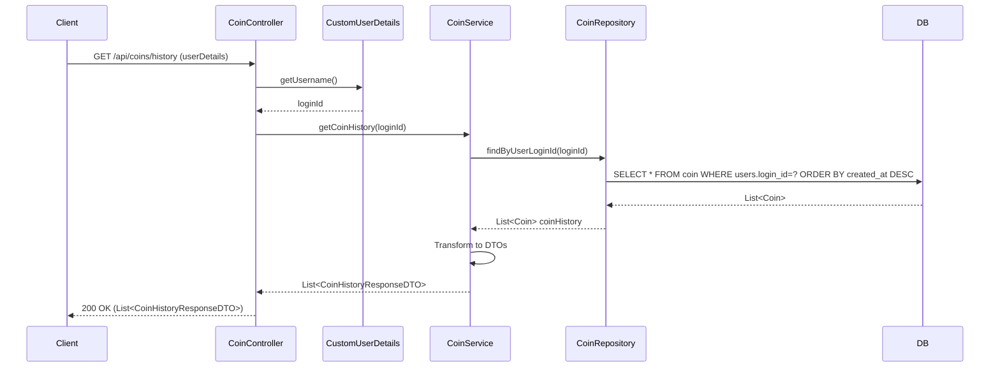

## Coin History Sequence Diagram

## 코인 내역 조회 (GET `/api/coins/history`)

| 항목 | 흐름 요약 | 핵심 비즈니스 로직 |
|:---|:---|:---|
| **목표** | 사용자의 코인 거래 내역 조회 | - |
| **요청 수신 및 인증** | `Client`가 내역 조회를 요청하면 `Controller`는 `CustomUserDetails`를 통해 **인증된 사용자를 식별**합니다. | **본인 거래 내역만 조회** |
| **거래 내역 조회** | `CoinService`는 `CoinRepository`의 `findByUserLoginId`를 통해 **사용자의 모든 코인 거래 내역을 생성일시 역순으로 조회**합니다. | 최신 거래 우선 정렬 (ORDER BY created_at DESC) |
| **타입 분류** | `Service`는 각 `Coin`의 **coinAmount가 양수면 "CHARGE", 음수면 "USE"**로 거래 타입을 설정합니다. | **거래 타입 동적 결정** |
| **응답 반환** | `Service`는 거래 내역 리스트를 DTO로 변환하여 `Controller`를 거쳐 `Client`에게 **HTTP 200 OK** 응답과 함께 반환합니다. | - |