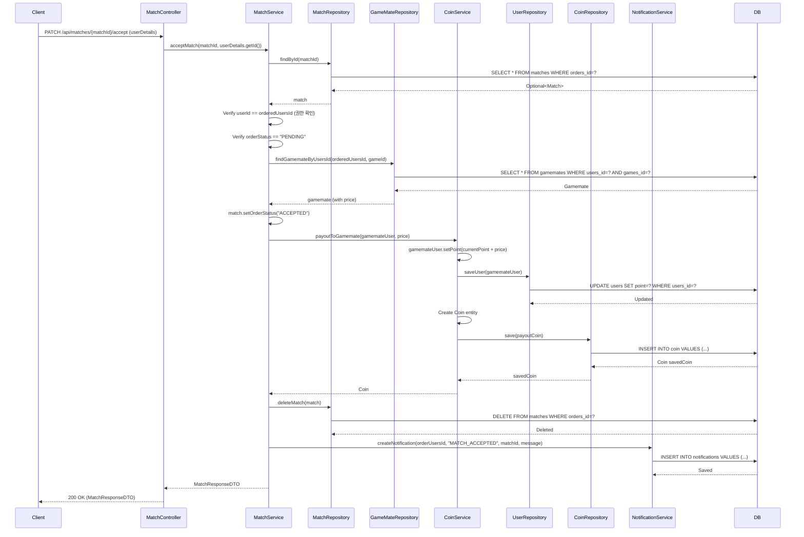

## Payout To Gamemate Sequence Diagram

---

## 매칭 수락 시 게임메이트 코인 지급 (PATCH `/api/matches/{matchId}/accept`)

| 항목 | 흐름 요약 | 핵심 비즈니스 로직 |
|:---|:---|:---|
| **목표** | 매칭 수락 시 게임메이트에게 코인을 지급하고 매칭 삭제 | - |
| **호출 시점** | 게임메이트가 매칭 수락 버튼을 클릭할 때 호출됩니다. | - |
| **권한 확인** | 매칭 상태 변경은 **게임메이트(orderedUsersId)만 가능**합니다. | **게임메이트만 수락 가능** |
| **상태 확인** | 매칭 상태가 **PENDING**인 경우에만 수락 가능합니다. | **대기 중인 매칭만 처리** |
| **포인트 증가** | `CoinService.payoutToGamemate()`는 게임메이트의 **point를 매칭 가격만큼 증가**시킵니다. | **포인트 지급** |
| **거래 기록** | `Coin` 엔티티를 생성하여 **지급 내역을 DB에 INSERT**합니다. | **거래 이력 저장** (coinAmount: 양수, paymentMethod: "GAMEMATE_PAYOUT") |
| **매칭 삭제** | `MatchService`는 매칭을 **DB에서 DELETE**합니다. | **매칭 레코드 삭제** |
| **알림 생성** | 요청자에게 **매칭 수락 알림**을 생성합니다. | **MATCH_ACCEPTED 알림** |
