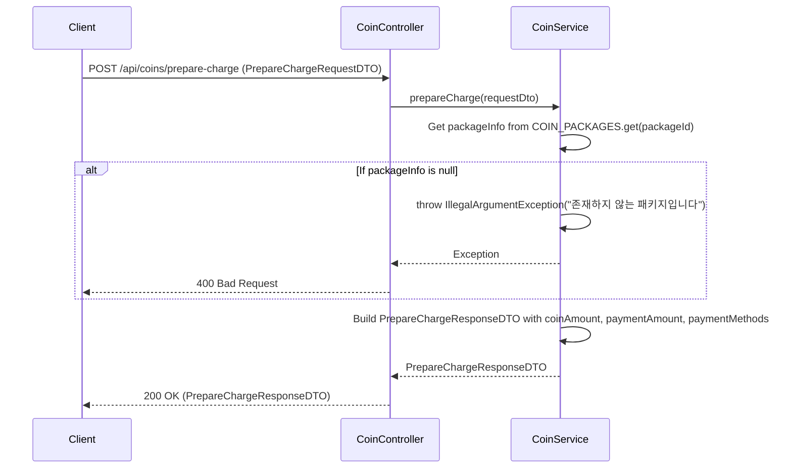

## Prepare Charge Sequence Diagram

---

## 충전 준비 (POST `/api/coins/prepare-charge`)

| 항목 | 흐름 요약 | 핵심 비즈니스 로직 |
|:---|:---|:---|
| **목표** | 선택한 패키지의 충전 정보 및 결제 수단 목록 조회 | - |
| **요청 수신** | `Client`가 `packageId`를 포함한 요청을 전달합니다. | - |
| **패키지 검증** | `CoinService`는 `COIN_PACKAGES` Map에서 `packageId`가 **유효한지** 확인합니다. | **패키지 존재 여부 확인** (예외 처리) |
| **결제 수단 제공** | 사용 가능한 결제 수단 목록(카드결제, 계좌이체, 간편 결제)을 제공합니다. | **결제 수단 안내** |
| **응답 반환** | `Service`는 코인 금액, 결제 금액, 결제 수단 목록을 담은 DTO를 반환합니다. | - |