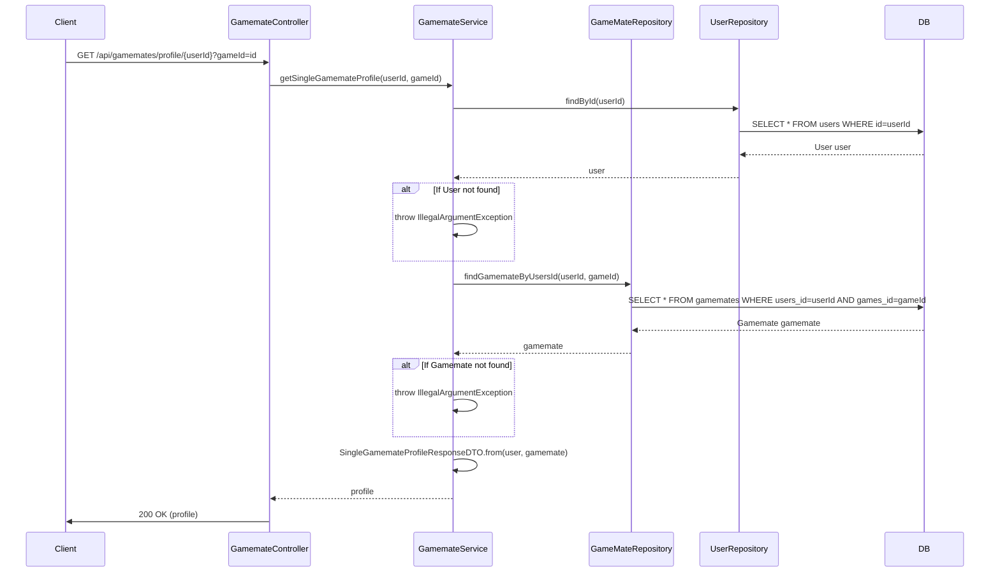

## Gamemate Detail Search Sequence Diagram

## 3. 게임메이트 프로필 조회 (GET `/api/gamemates/profile/{userId}`)

| 항목                 | 흐름 요약                                                                                                                           | 핵심 비즈니스 로직         |
|:-------------------|:--------------------------------------------------------------------------------------------------------------------------------|:-------------------|
| **목표**             | 특정 사용자의 특정 게임에 대한 상세 프로필 정보 조회                                                                                                  |                    |
| **요청 수신**          | `Client`가 `userId` 및 `gameId`를 포함하여 `Controller`에 요청합니다.                                                                        | -                  |
| **사용자 정보 조회**      | `Service`는 `UserRepository`를 통해 **대상 사용자 엔티티를 조회**하며, 존재 여부를 확인합니다.                                                             | 필수 사용자 정보 확보       |
| **Gamemate 정보 조회** | `Service`는 `GameMateRepository`를 통해 해당 `userId`와 `gameId`에 매핑되는 **특정 Gamemate 레코드를 조회**합니다.                                     | 정확한 프로필 레코드 식별     |
| **등록 확인 및 통합**     | `Gamemate` 레코드가 없으면 예외를 발생시킵니다. 레코드가 존재하면, `Service`는 **User 정보와 Gamemate 정보를 통합**하여 `SingleGamemateProfileResponseDTO`를 생성합니다. | **해당 게임 등록 여부 확인** |
| **응답 반환**          | `Controller`는 최종 통합 DTO를 `Client`에게 **HTTP 200 OK** 응답으로 전달합니다.                                                                 | -                  |