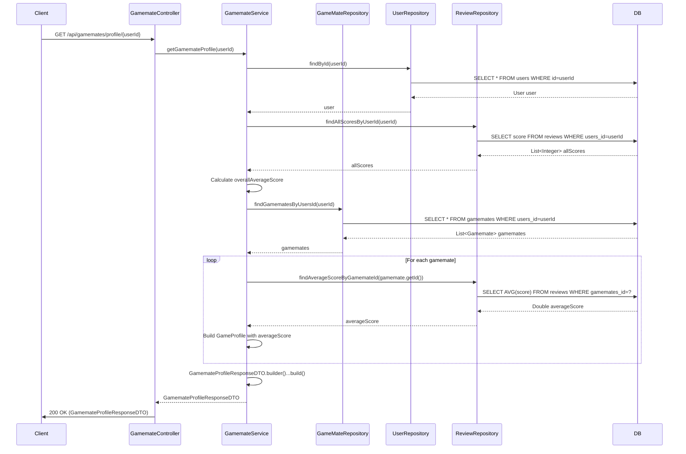

## Gamemate Detail Search Sequence Diagram

---

## 3. 게임메이트 프로필 조회 (GET `/api/gamemates/profile/{userId}`)

| 항목 | 흐름 요약 | 핵심 비즈니스 로직 |
|:---|:---|:---|
| **목표** | 특정 사용자의 게임메이트 프로필 정보 조회 (모든 게임 포함) | |
| **요청 수신** | `Client`가 `userId`를 포함하여 `Controller`에 요청합니다. | - |
| **사용자 정보 조회** | `Service`는 `UserRepository`를 통해 **대상 사용자 엔티티를 조회**합니다. | 필수 사용자 정보 확보 |
| **전체 평점 계산** | `ReviewRepository`를 통해 해당 사용자의 **모든 리뷰 점수를 조회**하여 전체 평균 점수를 계산합니다. | **overallAverageScore 계산** |
| **게임별 정보 조회** | `GameMateRepository`를 통해 해당 사용자의 **모든 Gamemate 레코드를 조회**합니다. | 사용자가 등록한 모든 게임 |
| **게임별 평점 계산** | 각 Gamemate에 대해 `ReviewRepository`를 통해 **게임별 평균 점수**를 계산합니다. | **게임별 averageScore 계산** |
| **응답 반환** | `Controller`는 `GamemateProfileResponseDTO`를 `Client`에게 **HTTP 200 OK** 응답으로 전달합니다. | - |

