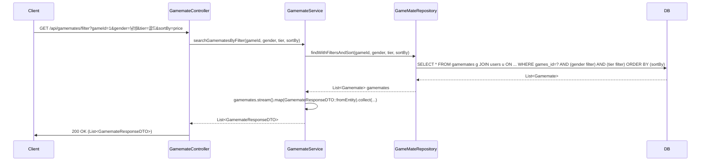

## Gamemate Filter Sequence Diagram

---

## 게임메이트 필터 검색 (GET `/api/gamemates/filter`)

| 항목 | 흐름 요약 | 핵심 비즈니스 로직 |
|:---|:---|:---|
| **목표** | 게임, 성별, 티어, 정렬 기준으로 게임메이트 필터링 검색 | - |
| **요청 수신** | `Client`가 쿼리 파라미터(gameId, gender, tier, sortBy)와 함께 요청합니다. | - |
| **파라미터 설명** | `gameId`: 필수, `gender`: 선택(기본값 "모두"), `tier`: 선택(기본값 "모두"), `sortBy`: 선택(기본값 "reviewsScore") | **동적 필터링** |
| **DB 조회** | `GameMateRepository`는 **Querydsl**을 사용하여 조건에 맞는 게임메이트를 조회합니다. | 필터 조건에 따른 동적 쿼리 |
| **정렬 옵션** | `sortBy`에 따라 가격순, 리뷰 점수순 등으로 정렬합니다. | **동적 정렬** |
| **응답 반환** | 필터링된 게임메이트 목록을 **HTTP 200 OK** 응답과 함께 반환합니다. | - |

---

**쿼리 파라미터:**

| 파라미터 | 필수 | 기본값 | 설명 |
|:---|:---:|:---|:---|
| gameId | O | - | 게임 ID |
| gender | X | "모두" | 성별 필터 (남성, 여성, 모두) |
| tier | X | "모두" | 티어 필터 (브론즈, 실버, 골드 등) |
| sortBy | X | "reviewsScore" | 정렬 기준 (price, reviewsScore 등) |
