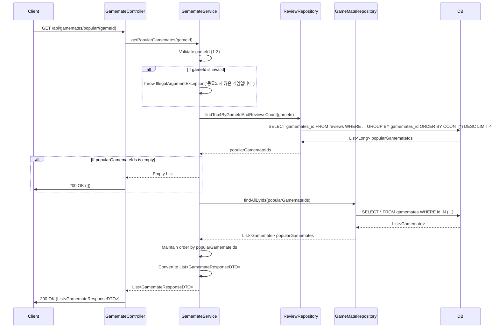

## Gamemate Popular Sequence Diagram

---

## 인기 게임메이트 조회 (GET `/api/gamemates/popular/{gameId}`)

| 항목 | 흐름 요약 | 핵심 비즈니스 로직 |
|:---|:---|:---|
| **목표** | 특정 게임에서 리뷰가 많은 인기 게임메이트 Top 4 조회 | - |
| **요청 수신** | `Client`가 `gameId`를 포함하여 요청합니다. | - |
| **게임 유효성 검사** | `gameId`가 유효한 범위(1-3)인지 확인합니다. | **등록된 게임만 조회 가능** |
| **인기 게임메이트 조회** | `ReviewRepository`를 통해 **리뷰 수가 많은 상위 4명의 게임메이트 ID**를 조회합니다. | **리뷰 수 기준 정렬** |
| **게임메이트 정보 조회** | 조회된 ID 목록으로 `GameMateRepository`에서 **게임메이트 상세 정보**를 조회합니다. | - |
| **순서 유지** | 리뷰 수 순서를 유지하여 결과를 반환합니다. | **인기 순 정렬 유지** |
| **응답 반환** | 인기 게임메이트 목록을 **HTTP 200 OK** 응답과 함께 반환합니다. | - |
