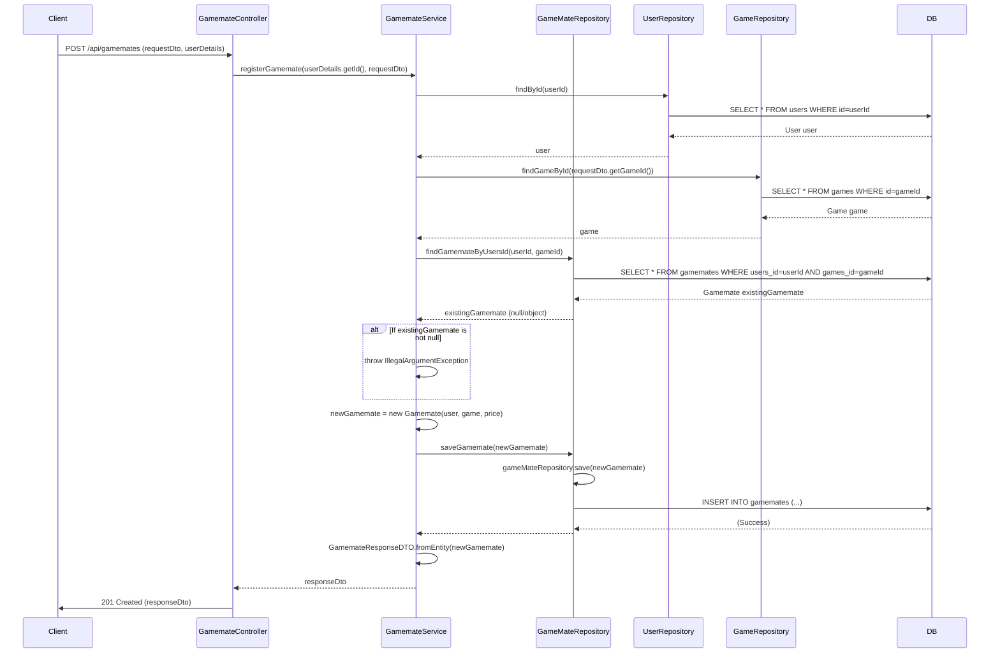

## Gamemate Register Sequence Diagram

## 1. 게임메이트 등록 (POST `/api/gamemates`)

| 항목             | 흐름 요약                                                                                                    | 핵심 비즈니스 로직            |
|:---------------|:---------------------------------------------------------------------------------------------------------|:----------------------|
| **목표**         | 특정 게임의 게임메이트 등록 및 가격 정보 설정                                                                               | 중복 등록 방지              |
| **요청 수신 및 인증** | `Client` 요청 수신 후, `Controller`는 `userDetails`를 통해 **사용자 ID를 추출**하여 `Service`로 전달합니다.                     | -                     |
| **필수 데이터 확인**  | `GamemateService`는 `UserRepository`와 `GameRepository`를 통해 등록에 필요한 **User** 및 **Game** 엔티티의 존재 유무를 확인합니다. | 유효성 검사 (사용자/게임 존재)    |
| **중복 등록 방지**   | `Service`는 `GameMateRepository`의 `findGamemateByUsersId`를 호출하여 **해당 조합의 레코드가 이미 DB에 있는지** 확인합니다.         | **중복 레코드 확인** (예외 처리) |
| **데이터 저장**     | 중복이 없으면, `Service`는 새 `Gamemate` 엔티티를 생성하고, `GameMateRepository`를 통해 DB에 **INSERT**를 요청합니다.              | 트랜잭션 기반 데이터 저장        |
| **응답 반환**      | `Service`는 저장된 엔티티를 DTO로 변환하여 `Controller`를 거쳐 `Client`에게 **HTTP 201 Created** 응답과 함께 반환합니다.             | -                     |
