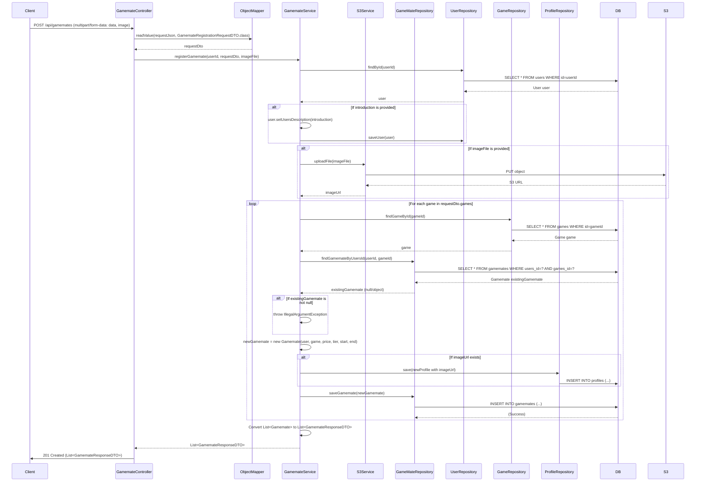

## Gamemate Register Sequence Diagram

---

## 1. 게임메이트 등록 (POST `/api/gamemates`)

| 항목 | 흐름 요약 | 핵심 비즈니스 로직 |
|:---|:---|:---|
| **목표** | 특정 게임의 게임메이트 등록 및 가격 정보 설정 | 중복 등록 방지, 다중 게임 등록 |
| **요청 형식** | `multipart/form-data`로 JSON 데이터(`data`)와 이미지 파일(`image`)을 함께 전송합니다. | **JSON + 이미지 동시 업로드** |
| **JSON 파싱** | `ObjectMapper`를 사용하여 JSON 문자열을 `GamemateRegistrationRequestDTO`로 변환합니다. | - |
| **자기소개 업데이트** | `introduction`이 제공되면 사용자의 `usersDescription`을 업데이트합니다. | 사용자 정보 업데이트 |
| **이미지 업로드** | 이미지 파일이 제공되면 `S3Service`를 통해 **S3에 업로드**하고 URL을 획득합니다. | **S3 이미지 업로드** |
| **다중 게임 등록** | `requestDto.games` 배열을 순회하며 각 게임에 대해 게임메이트를 등록합니다. | **여러 게임 동시 등록** |
| **중복 등록 방지** | 각 게임에 대해 `findGamemateByUsersId`를 호출하여 **이미 등록되어 있는지** 확인합니다. | **중복 레코드 확인** (예외 처리) |
| **프로필 이미지 연결** | 이미지 URL이 있으면 `Profile` 엔티티를 생성하여 `Gamemate`와 연결합니다. | **프로필 이미지 관리** |
| **응답 반환** | 등록된 모든 게임메이트를 `List<GamemateResponseDTO>`로 변환하여 **HTTP 201 Created** 응답과 함께 반환합니다. | - |

