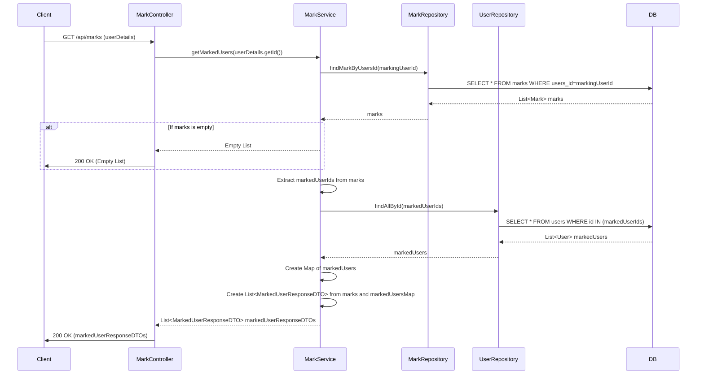

## Mark Get Marked Users Sequence Diagram

## 2. 즐겨찾기 목록 조회 (GET `/api/marks`)

| 항목              | 흐름 요약                                                                                                      | 핵심 비즈니스 로직            |
|:----------------|:-----------------------------------------------------------------------------------------------------------|:----------------------|
| **목표**          | 현재 로그인된 사용자가 즐겨찾기한 모든 사용자 목록을 조회                                                                           | -                     |
| **요청 수신 및 인증**  | `Client` 요청 수신 후, `Controller`는 `userDetails`를 통해 **사용자 ID를 추출**하여 `Service`로 전달합니다.                       | -                     |
| **즐겨찾기 목록 조회**  | `MarkService`는 `MarkRepository`를 통해 현재 사용자가 즐겨찾기한 모든 `Mark` 엔티티 목록을 조회합니다.                                 | -                     |
| **사용자 정보 조회**   | `Service`는 조회된 `Mark` 목록에서 `markedUserId`들을 추출하여, `UserRepository`를 통해 해당 사용자들의 `User` 엔티티 목록을 한 번에 조회합니다. | **IN 쿼리를 통한 효율적인 조회** |
| **데이터 조합 및 변환** | `Service`는 조회된 `User` 목록을 `Map`으로 변환하여 빠른 조회를 가능하게 하고, `Mark` 목록과 조합하여 `MarkedUserResponseDTO` 목록을 생성합니다.  | 데이터 조합 및 DTO 변환       |
| **응답 반환**       | `Service`는 생성된 DTO 목록을 `Controller`를 거쳐 `Client`에게 **HTTP 200 OK** 응답과 함께 반환합니다.                           | -                     |