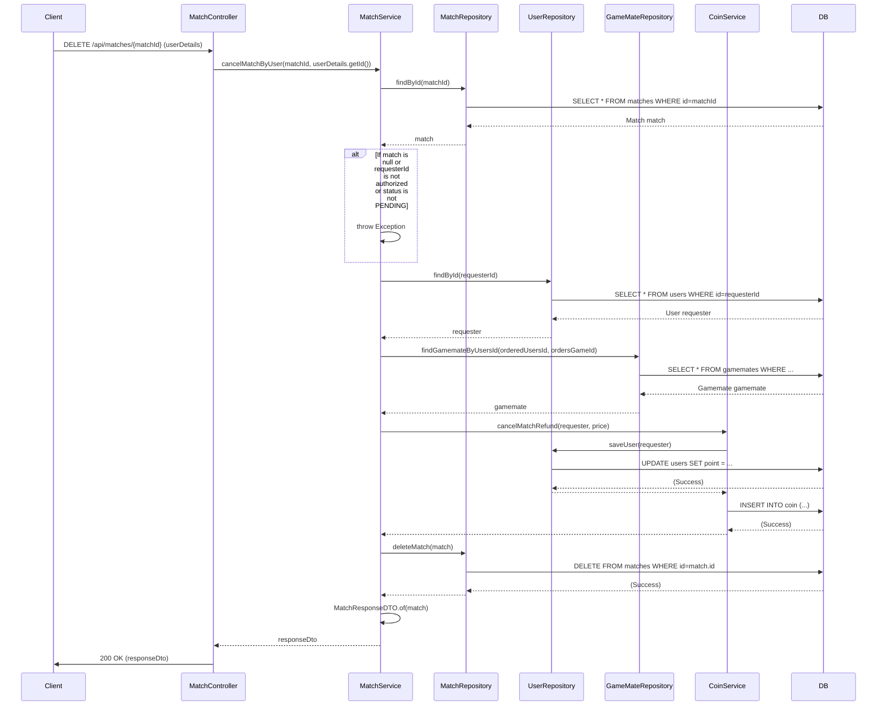

## Match Cancel Sequence Diagram

## 3. 매칭 취소 (DELETE `/api/matches/{matchId}`)

| 항목             | 흐름 요약                                                                                     | 핵심 비즈니스 로직    |
|:---------------|:------------------------------------------------------------------------------------------|:--------------|
| **목표**         | 사용자가 요청했던 매칭을 취소                                                                          | 코인 환불 및 매칭 삭제 |
| **요청 수신 및 인증** | `Client` 요청 수신 후, `Controller`는 `userDetails`를 통해 **사용자 ID를 추출**하여 `Service`로 전달합니다.      | -             |
| **권한 확인**      | `MatchService`는 요청을 보낸 사용자가 매칭을 요청한 본인인지, 그리고 매칭 상태가 `PENDING`인지 확인합니다.                   | -             |
| **데이터 조회**     | `Service`는 `MatchRepository`, `UserRepository`, `GameMateRepository`를 통해 필요한 엔티티들을 조회합니다. | -             |
| **코인 환불**      | `Service`는 `CoinService`를 호출하여 요청자에게 코인을 환불하고, 관련 내역을 기록합니다.                              | 코인 시스템 연동     |
| **매칭 삭제**      | `Service`는 `MatchRepository`를 통해 DB에서 `Match` 엔티티를 삭제합니다.                                 | -             |
| **응답 반환**      | `Service`는 처리 결과를 DTO로 변환하여 `Controller`를 거쳐 `Client`에게 **HTTP 200 OK** 응답과 함께 반환합니다.     | -             |