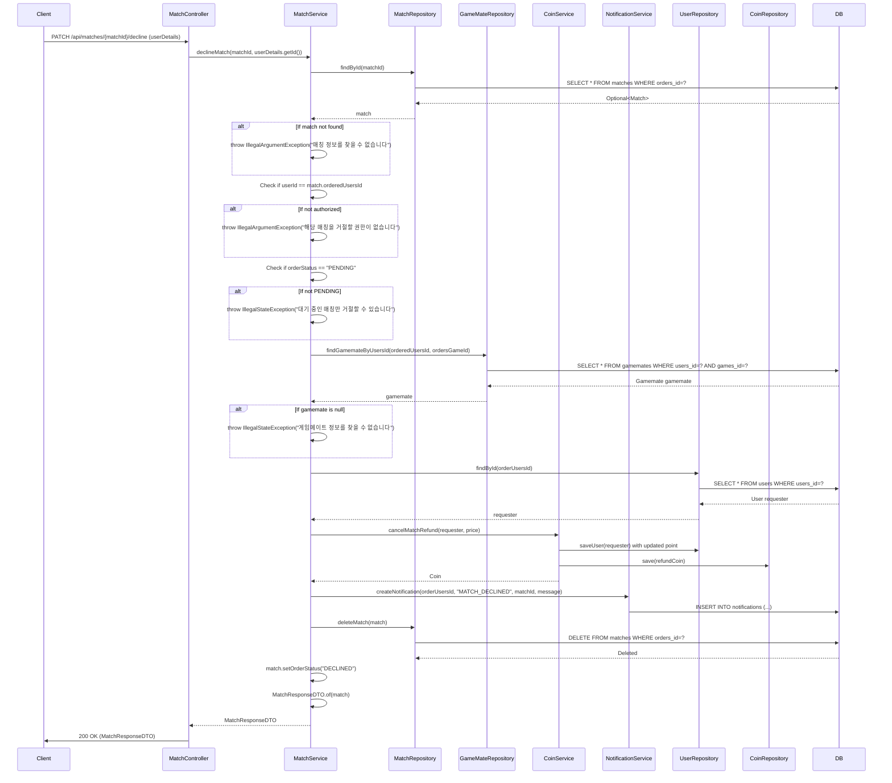

## Match Decline Sequence Diagram

---

## 매칭 거절 (PATCH `/api/matches/{matchId}/decline`)

| 항목 | 흐름 요약 | 핵심 비즈니스 로직 |
|:---|:---|:---|
| **목표** | 게임메이트가 매칭 요청을 거절 | 코인 환불 및 매칭 삭제 |
| **요청 수신 및 인증** | `Client` 요청 수신 후, `Controller`는 `userDetails`를 통해 **사용자 ID를 추출**하여 `Service`로 전달합니다. | - |
| **매칭 조회** | `MatchService`는 `MatchRepository`를 통해 매칭 정보를 조회합니다. | **매칭 존재 확인** |
| **권한 확인** | 요청자가 **매칭을 받은 게임메이트 본인인지** 확인합니다. | **orderedUsersId == userId** |
| **상태 확인** | 매칭 상태가 **PENDING**인지 확인합니다. | **대기 중인 매칭만 거절 가능** |
| **게임메이트 조회** | `GameMateRepository`를 통해 게임메이트 정보와 가격을 조회합니다. | - |
| **요청자 조회** | `UserRepository`를 통해 원래 매칭 요청자를 조회합니다. | - |
| **코인 환불** | `CoinService.cancelMatchRefund()`를 통해 요청자에게 **코인을 환불**합니다. | **MATCH_CANCELLED 거래 생성** |
| **알림 생성** | 요청자에게 **매칭 거절 알림**을 생성합니다. | **MATCH_DECLINED 알림** |
| **매칭 삭제** | 거절 완료 후 **매칭 레코드를 DB에서 삭제**합니다. | **매칭 기록 삭제** |
| **응답 반환** | 거절된 매칭 정보를 DTO로 변환하여 **HTTP 200 OK** 응답과 함께 반환합니다. | - |
