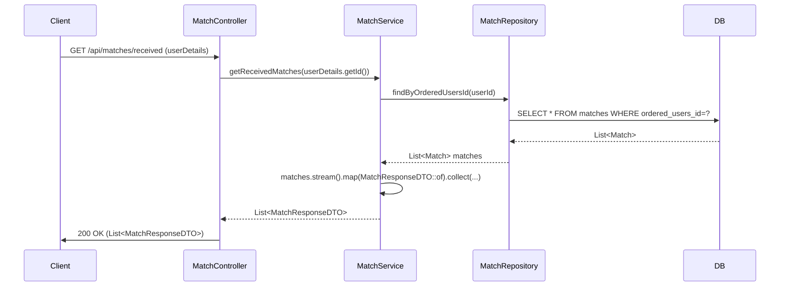

## Match Get Received Sequence Diagram

---

## 받은 매칭 목록 조회 (GET `/api/matches/received`)

| 항목 | 흐름 요약 | 핵심 비즈니스 로직 |
|:---|:---|:---|
| **목표** | 현재 로그인한 사용자가 받은 매칭 요청 목록 조회 | - |
| **요청 수신 및 인증** | `Client` 요청 수신 후, `Controller`는 `userDetails`를 통해 **사용자 ID를 추출**하여 `Service`로 전달합니다. | - |
| **매칭 조회** | `MatchService`는 `MatchRepository`의 `findByOrderedUsersId`를 통해 **해당 사용자가 수신자(orderedUsersId)인 모든 매칭**을 조회합니다. | **본인이 받은 매칭만 조회** |
| **DTO 변환** | 조회된 `List<Match>`를 `List<MatchResponseDTO>`로 변환합니다. | - |
| **응답 반환** | `Controller`는 매칭 목록을 `Client`에게 **HTTP 200 OK** 응답과 함께 반환합니다. | - |
