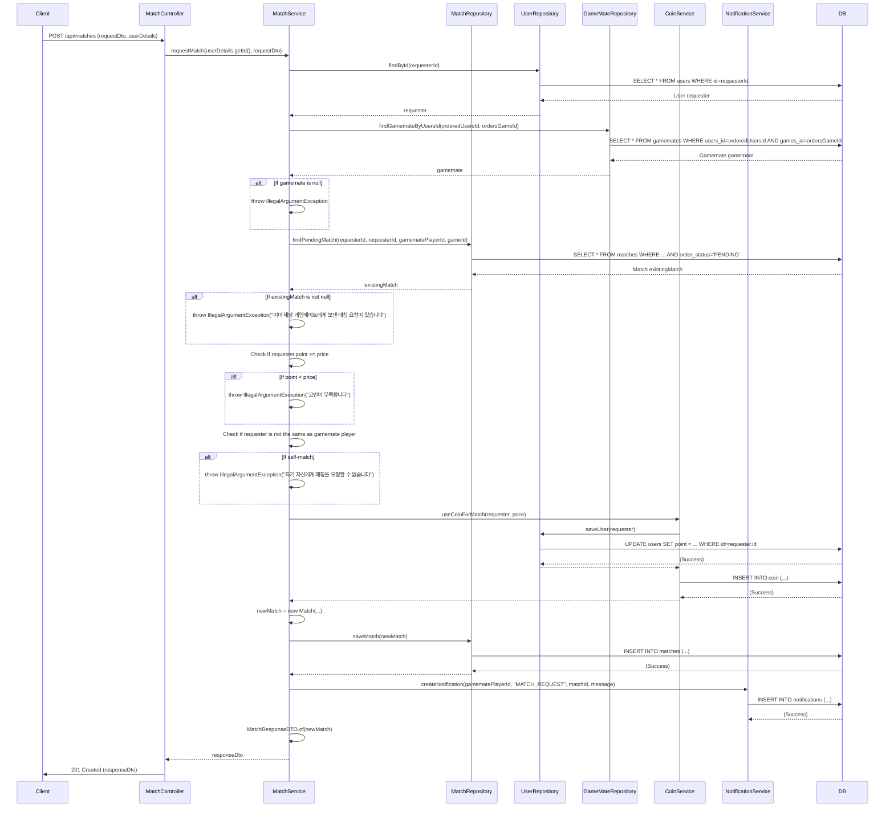

## Match Request Sequence Diagram

---

## 1. 매칭 요청 (POST `/api/matches`)

| 항목 | 흐름 요약 | 핵심 비즈니스 로직 |
|:---|:---|:---|
| **목표** | 특정 게임메이트에게 매칭을 요청 | 코인 차감 및 매칭 생성 |
| **요청 수신 및 인증** | `Client` 요청 수신 후, `Controller`는 `userDetails`를 통해 **사용자 ID를 추출**하여 `Service`로 전달합니다. | - |
| **데이터 조회** | `MatchService`는 `UserRepository`와 `GameMateRepository`를 통해 매칭에 필요한 `User` 및 `Gamemate` 엔티티를 조회합니다. | - |
| **중복 매칭 확인** | 동일한 게임메이트에게 **이미 PENDING 상태의 매칭 요청이 있는지** 확인합니다. | **중복 매칭 요청 방지** |
| **코인 부족 확인** | 요청자의 **보유 코인이 매칭 가격보다 적은지** 확인합니다. | **코인 부족 검증** |
| **자기 매칭 방지** | `Service`는 요청자가 자기 자신에게 매칭을 요청하는지 확인합니다. | 자기 자신에게 매칭 요청 방지 |
| **코인 차감** | `Service`는 `CoinService`를 호출하여 요청자의 코인을 차감하고, 코인 사용 내역을 기록합니다. | 코인 시스템 연동 |
| **매칭 생성** | `Service`는 새로운 `Match` 엔티티를 생성하고, `MatchRepository`를 통해 DB에 **INSERT**를 요청합니다. | - |
| **알림 생성** | 게임메이트에게 **매칭 요청 알림**을 생성합니다. | **MATCH_REQUEST 알림** |
| **응답 반환** | `Service`는 생성된 `Match` 엔티티를 DTO로 변환하여 `Controller`를 거쳐 `Client`에게 **HTTP 201 Created** 응답과 함께 반환합니다. | - |
