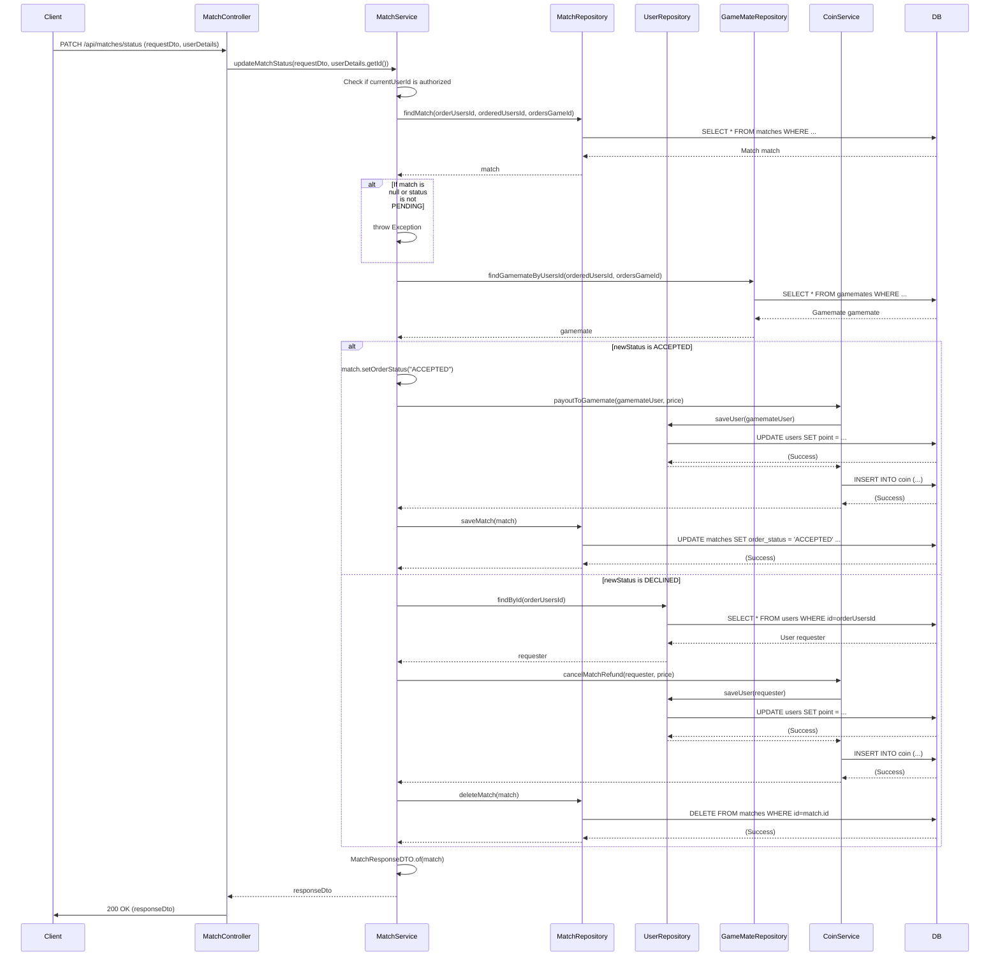

## Match Update Status Sequence Diagram

## 2. 매칭 상태 업데이트 (PATCH `/api/matches/status`)

| 항목             | 흐름 요약                                                                                        | 핵심 비즈니스 로직          |
|:---------------|:---------------------------------------------------------------------------------------------|:--------------------|
| **목표**         | 게임메이트가 매칭 요청의 상태를 수락 또는 거절                                                                   | 코인 지급/환불 및 매칭 상태 변경 |
| **요청 수신 및 인증** | `Client` 요청 수신 후, `Controller`는 `userDetails`를 통해 **사용자 ID를 추출**하여 `Service`로 전달합니다.         | -                   |
| **권한 확인**      | `MatchService`는 요청을 보낸 사용자가 매칭을 받은 게임메이트 본인인지 확인합니다.                                         | -                   |
| **매칭 정보 조회**   | `Service`는 `MatchRepository`를 통해 업데이트할 `Match` 엔티티를 조회하고, 상태가 `PENDING`인지 확인합니다.             | -                   |
| **상태 분기 처리**   | `Service`는 요청된 새로운 상태(`ACCEPTED` 또는 `DECLINED`)에 따라 다른 비즈니스 로직을 수행합니다.                       | -                   |
| **수락 시**       | `Match` 상태를 `ACCEPTED`로 변경하고, `CoinService`를 통해 게임메이트에게 코인을 지급한 후, `Match` 엔티티를 DB에 업데이트합니다. | 코인 지급               |
| **거절 시**       | `CoinService`를 통해 요청자에게 코인을 환불하고, `Match` 엔티티를 DB에서 삭제합니다.                                   | 코인 환불 및 매칭 삭제       |
| **응답 반환**      | `Service`는 처리 결과를 DTO로 변환하여 `Controller`를 거쳐 `Client`에게 **HTTP 200 OK** 응답과 함께 반환합니다.        | -                   |