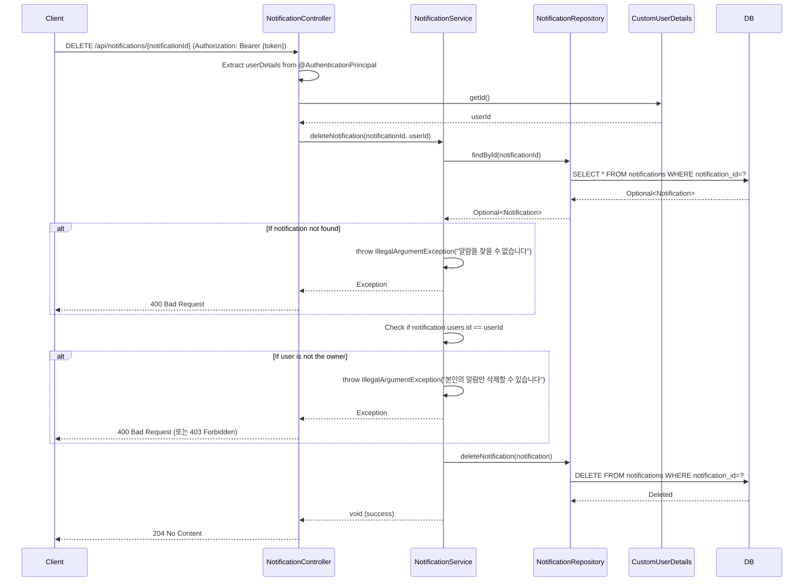

## Delete Notification Sequence Diagram

## 알림 삭제 (DELETE `/api/notifications/{notificationId}`)

| 항목 | 흐름 요약 | 핵심 비즈니스 로직 |
|:---|:---|:---|
| **목표** | 특정 알림을 삭제 | - |
| **요청 수신** | `Client`가 JWT Access Token과 **notificationId**를 포함하여 요청하면 `NotificationController`는 `@AuthenticationPrincipal`을 통해 **현재 인증된 사용자 정보를 추출**합니다. | **JWT 기반 사용자 식별** |
| **사용자 ID 추출** | `CustomUserDetails`에서 **userId**를 가져옵니다. | - |
| **알림 조회** | `NotificationRepository`가 **notificationId로 알림을 조회**합니다. | 알림 존재 확인 |
| **알림 없음 처리** | 알림이 존재하지 않으면 **400 Bad Request**를 반환합니다. | 예외 처리 |
| **소유권 확인** | 조회된 알림의 **users.id가 현재 사용자의 userId와 일치하는지** 확인합니다. | **권한 검증 (Authorization)** |
| **권한 없음 처리** | 소유자가 아니면 **400 Bad Request** (또는 403 Forbidden)를 반환합니다. | 타인의 알림 삭제 방지 |
| **알림 삭제** | `NotificationRepository`를 통해 **DB에서 알림을 삭제**합니다. | DELETE 쿼리 실행 |
| **응답 반환** | `Client`에게 **HTTP 204 No Content** 응답을 반환합니다. | - |
