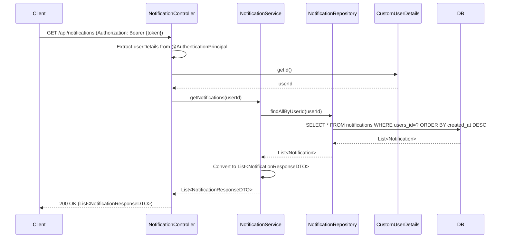

## Get Notifications Sequence Diagram

## 알림 목록 조회 (GET `/api/notifications`)

| 항목 | 흐름 요약 | 핵심 비즈니스 로직 |
|:---|:---|:---|
| **목표** | 현재 로그인한 사용자의 모든 알림 목록 조회 | - |
| **요청 수신** | `Client`가 JWT Access Token을 포함하여 요청하면 `NotificationController`는 `@AuthenticationPrincipal`을 통해 **현재 인증된 사용자 정보를 추출**합니다. | **JWT 기반 사용자 식별** |
| **사용자 ID 추출** | `CustomUserDetails`에서 **userId**를 가져옵니다. | - |
| **알림 조회** | `NotificationService`가 `NotificationRepository`를 통해 **해당 사용자의 모든 알림을 조회**합니다. | 사용자별 알림 필터링 |
| **DTO 변환** | 조회된 `Notification` 엔티티를 **NotificationResponseDTO 리스트**로 변환합니다. | 엔티티 → DTO 변환 |
| **응답 반환** | 알림 목록을 `Client`에게 **HTTP 200 OK** 응답과 함께 반환합니다. | - |