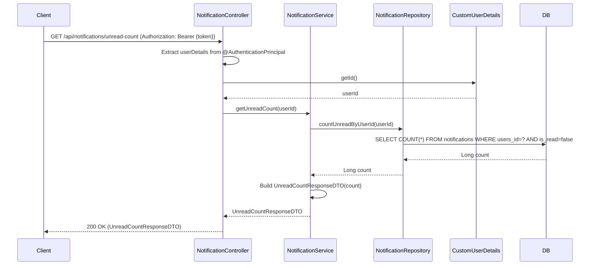

## Get Unread Notification Count Sequence Diagram

## 읽지 않은 알림 개수 조회 (GET `/api/notifications/unread-count`)

| 항목 | 흐름 요약 | 핵심 비즈니스 로직 |
|:---|:---|:---|
| **목표** | 현재 로그인한 사용자의 읽지 않은 알림 개수 조회 | - |
| **요청 수신** | `Client`가 JWT Access Token을 포함하여 요청하면 `NotificationController`는 `@AuthenticationPrincipal`을 통해 **현재 인증된 사용자 정보를 추출**합니다. | **JWT 기반 사용자 식별** |
| **사용자 ID 추출** | `CustomUserDetails`에서 **userId**를 가져옵니다. | - |
| **읽지 않은 알림 개수 조회** | `NotificationRepository`가 **is_read=false인 알림의 개수**를 카운트합니다. | COUNT 쿼리 실행 |
| **DTO 생성** | `UnreadCountResponseDTO`를 생성하여 **읽지 않은 알림 개수**를 담습니다. | - |
| **응답 반환** | 개수 정보를 `Client`에게 **HTTP 200 OK** 응답과 함께 반환합니다. | - |
