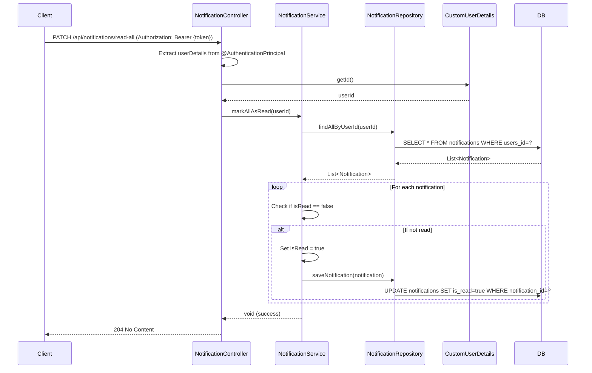

## Mark All Notifications As Read Sequence Diagram

## 모든 알림 읽음 처리 (PATCH `/api/notifications/read-all`)

| 항목 | 흐름 요약 | 핵심 비즈니스 로직 |
|:---|:---|:---|
| **목표** | 현재 로그인한 사용자의 모든 알림을 읽음 상태로 변경 | - |
| **요청 수신** | `Client`가 JWT Access Token을 포함하여 요청하면 `NotificationController`는 `@AuthenticationPrincipal`을 통해 **현재 인증된 사용자 정보를 추출**합니다. | **JWT 기반 사용자 식별** |
| **사용자 ID 추출** | `CustomUserDetails`에서 **userId**를 가져옵니다. | - |
| **알림 조회** | `NotificationService`가 **해당 사용자의 모든 알림을 조회**합니다. | - |
| **읽음 처리** | 각 알림을 순회하며 **isRead가 false인 알림만 true로 변경**하고 DB에 저장합니다. | 선택적 업데이트 (이미 읽은 알림은 건너뜀) |
| **응답 반환** | `Client`에게 **HTTP 204 No Content** 응답을 반환합니다. | - |