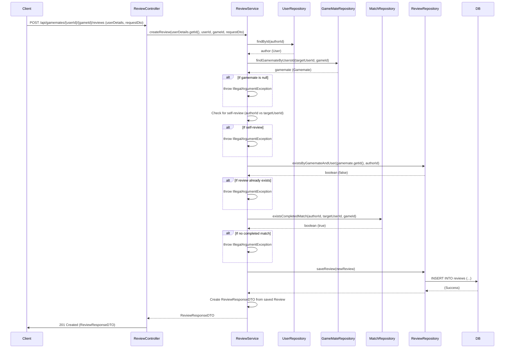

## Review Create Sequence Diagram

 

## 리뷰 작성 (POST `/api/gamemates/{userId}/{gameId}/reviews`)

| 항목             | 흐름 요약                                                                                                                            | 핵심 비즈니스 로직                                                                                                |
|:---------------|:-------------------------------------------------------------------------------------------------------------------------------------|:------------------------------------------------------------------------------------------------------------------|
| **목표**         | 특정 게임메이트의 특정 게임 플레이에 대한 리뷰를 작성                                                                                       | -                                                                                                                 |
| **요청 수신 및 인증** | `Client` 요청 수신 후, `Controller`는 `userDetails`에서 **리뷰 작성자 ID**를, URL 경로에서 **대상 유저/게임 ID**를 추출하여 `Service`로 전달합니다. | -                                                                                                                 |
| **유효성 검증 1**   | `ReviewService`는 DB에서 **리뷰 작성자(author)**와 **리뷰 대상(gamemate)** 정보를 조회합니다.                                             | - 대상 `gamemate` 존재 여부                                                                                       |
| **유효성 검증 2**   | `Service`는 비즈니스 규칙에 따라 리뷰 작성 자격을 검증합니다.                                                                          | - **셀프 리뷰** 방지 - **중복 리뷰** 방지 - **완료된 매칭** 존재 여부                                               |
| **데이터 생성**     | 모든 검증 통과 시, `Service`는 `Review` 엔티티를 생성하여 `ReviewRepository`를 통해 DB에 **INSERT**를 요청합니다.                         | -                                                                                                                 |
| **응답 반환**      | `Controller`는 생성된 리뷰 정보를 담은 `ReviewResponseDTO`와 함께 **HTTP 201 Created** 응답을 반환합니다.                                | -                                                                                                                 |
