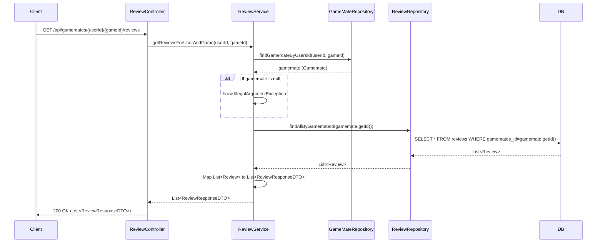

## Review Get Sequence Diagram

 

## 리뷰 목록 조회 (GET `/api/gamemates/{userId}/{gameId}/reviews`)

| 항목          | 흐름 요약                                                                                                                            | 핵심 비즈니스 로직                                                                                                |
|:--------------|:-------------------------------------------------------------------------------------------------------------------------------------|:------------------------------------------------------------------------------------------------------------------|
| **목표**      | 특정 게임메이트의 특정 게임에 대한 모든 리뷰 목록을 조회                                                                                     | -                                                                                                                 |
| **요청 수신**   | `Client` 요청 수신 후, `Controller`는 URL 경로에서 **대상 유저 ID**와 **게임 ID**를 추출하여 `Service`로 전달합니다.                               | -                                                                                                                 |
| **게임메이트 확인** | `ReviewService`는 `GameMateRepository`를 통해 `userId`와 `gameId`에 해당하는 `Gamemate` 정보가 존재하는지 확인합니다.                      | - 대상 `gamemate` 존재 여부 (예외 처리)                                                                           |
| **데이터 조회**   | `Service`는 조회된 `gamemate`의 ID를 `ReviewRepository`에 전달하여, 해당 게임메이트에 대한 모든 `Review` 목록을 DB에서 **SELECT** 요청합니다. | -                                                                                                                 |
| **응답 반환**   | `Controller`는 조회된 리뷰 목록을 `List<ReviewResponseDTO>` 형태로 `Client`에게 **HTTP 200 OK** 응답을 반환합니다.                         | -                                                                                                                 |
