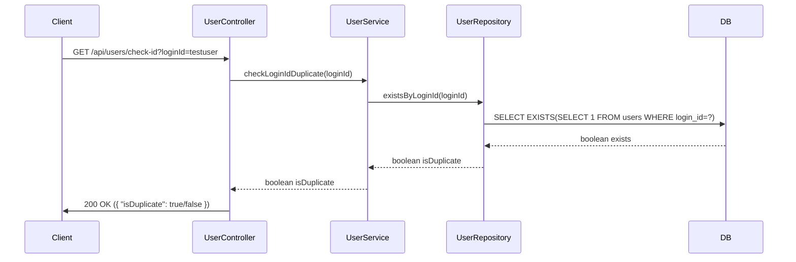

## Check ID Duplicate Sequence Diagram



---

## 아이디 중복 확인 (GET `/api/users/check-id`)

| 항목 | 흐름 요약 | 핵심 비즈니스 로직 |
|:---|:---|:---|
| **목표** | 회원가입 전 아이디 중복 여부 확인 | - |
| **요청 수신** | `Client`가 `loginId` 쿼리 파라미터와 함께 요청합니다. | - |
| **중복 확인** | `UserService`는 `UserRepository`의 `existsByLoginId`를 통해 **해당 loginId가 이미 존재하는지** 확인합니다. | **EXISTS 쿼리 사용** |
| **응답 반환** | 중복 여부를 `{ "isDuplicate": boolean }` 형태로 **HTTP 200 OK** 응답과 함께 반환합니다. | - |

---

**요청 예시:**

```
GET /api/users/check-id?loginId=newuser123
```

**응답 예시:**

```json
{
  "isDuplicate": false
}
```
