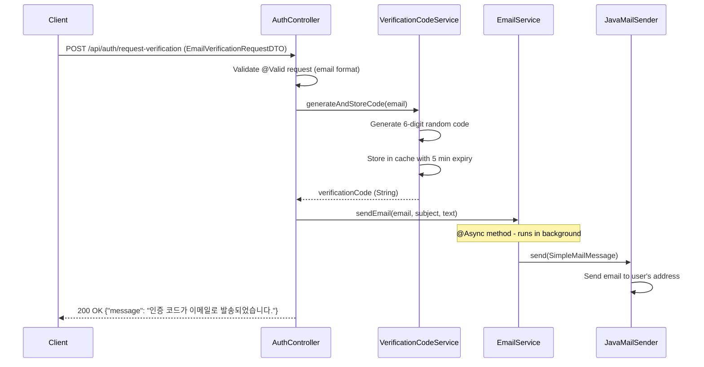

## Email Verification Sequence Diagram

## 이메일 인증 코드 요청 (POST `/api/auth/request-verification`)

| 항목 | 흐름 요약 | 핵심 비즈니스 로직 |
|:---|:---|:---|
| **목표** | 회원가입을 위한 이메일 인증 코드 발송 | - |
| **요청 수신** | `Client`가 이메일 주소를 전달하면 `AuthController`는 `EmailVerificationRequestDTO`를 통해 **이메일 형식을 검증**합니다. | DTO Validation (이메일 형식 검증) |
| **인증 코드 생성** | `VerificationCodeService`가 **6자리 랜덤 숫자 코드를 생성**합니다. | 인증 코드 생성 |
| **코드 저장** | 생성된 코드를 **캐시(메모리)에 저장**하고 **5분 후 자동 만료**되도록 설정합니다. | 임시 저장소에 TTL 적용 |
| **이메일 발송** | `EmailService`의 **@Async 메서드**를 통해 **백그라운드에서 이메일을 발송**합니다. | 비동기 이메일 전송 |
| **응답 반환** | 이메일 발송 대기 없이 즉시 **HTTP 200 OK** 응답을 반환합니다. | 빠른 응답 처리 |