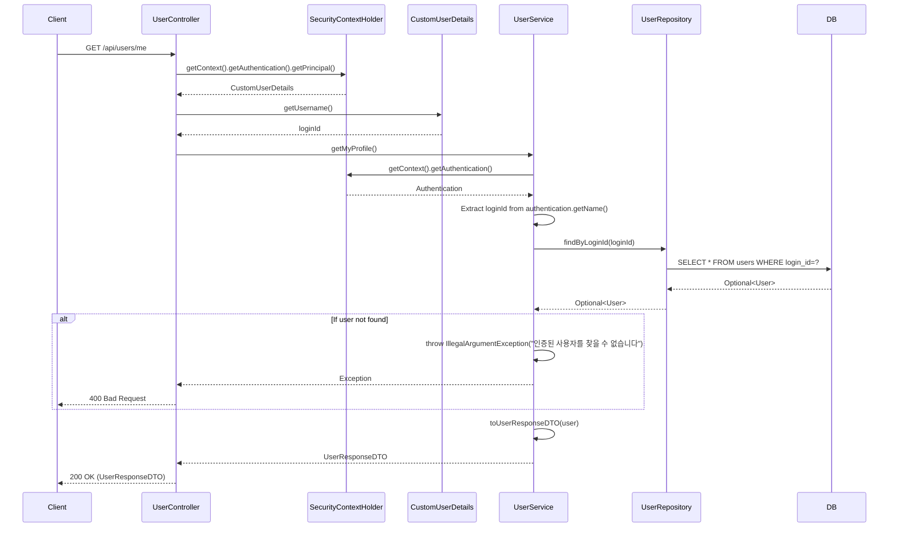

## Get Profile Sequence Diagram

---

## 프로필 조회 (GET `/api/users/me`)

| 항목 | 흐름 요약 | 핵심 비즈니스 로직 |
|:---|:---|:---|
| **목표** | 현재 로그인한 사용자의 프로필 정보 조회 | - |
| **요청 수신 및 인증** | `Client`가 프로필 조회를 요청하면 `Controller`는 `SecurityContextHolder`에서 **인증된 사용자 정보(CustomUserDetails)**를 추출합니다. | **@AuthenticationPrincipal을 통한 인증 사용자 식별** |
| **사용자 조회** | `UserService`는 `SecurityContextHolder`에서 `loginId`를 추출하고, `UserRepository`의 `findByLoginId`를 통해 **사용자 정보를 조회**합니다. | 사용자 존재 확인 (예외 처리) |
| **데이터 변환** | `Service`는 `User` 엔티티를 `UserResponseDTO`로 변환합니다. | 민감 정보 제외 (loginPwd, loginFailCount) |
| **응답 반환** | `Controller`는 사용자 프로필 정보를 `Client`에게 **HTTP 200 OK** 응답과 함께 반환합니다. | - |
