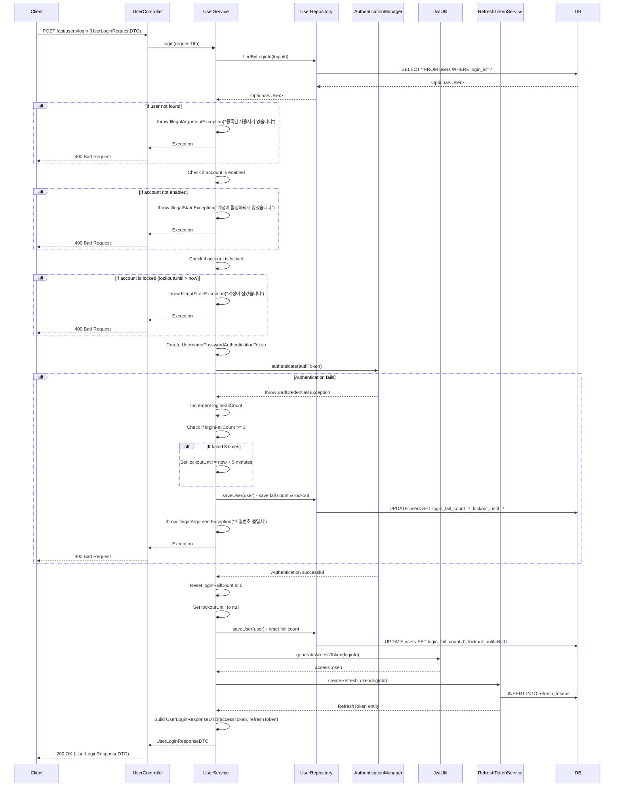

## Login Sequence Diagram

## 로그인 (POST `/api/users/login`)

| 항목 | 흐름 요약 | 핵심 비즈니스 로직 |
|:---|:---|:---|
| **목표** | 사용자 인증 및 JWT 토큰 발급 | - |
| **요청 수신** | `Client`가 loginId와 loginPwd를 전달하면 `Controller`는 `UserLoginRequestDTO`를 통해 `Service`로 전달합니다. | - |
| **사용자 조회** | `UserService`는 `UserRepository`의 `findByLoginId`를 통해 **사용자가 존재하는지** 확인합니다. | **사용자 존재 확인** (예외 처리) |
| **계정 활성화 확인** | `enabled` 필드를 확인하여 **계정이 활성화되었는지** 검증합니다. | **이메일 인증 완료 여부 확인** |
| **계정 잠금 확인** | `lockoutUntil`을 확인하여 **계정이 잠금 상태인지** 검증합니다. | **무차별 대입 공격(Brute Force) 방어** |
| **인증 토큰 생성** | `UsernamePasswordAuthenticationToken`을 생성합니다. | - |
| **인증 수행** | `AuthenticationManager`가 **비밀번호를 검증**합니다. | **비밀번호 검증** |
| **인증 실패 처리** | 비밀번호가 일치하지 않으면 `loginFailCount`를 증가시키고, **3회 실패 시 5분간 계정을 잠금**합니다. | **로그인 실패 횟수 추적 및 계정 잠금** |
| **인증 성공 처리** | `loginFailCount`를 0으로 리셋하고 `lockoutUntil`을 null로 설정합니다. | **로그인 성공 시 실패 카운터 초기화** |
| **Access Token 발급** | `JwtUtil`을 통해 **JWT Access Token**을 생성합니다. | **JWT 기반 무상태(Stateless) 인증** |
| **Refresh Token 발급** | `RefreshTokenService`를 통해 **Refresh Token**을 생성하고 DB에 저장합니다. | **토큰 갱신을 위한 Refresh Token 관리** |
| **응답 반환** | `Service`는 accessToken과 refreshToken을 담은 `UserLoginResponseDTO`를 `Controller`를 거쳐 `Client`에게 **HTTP 200 OK** 응답과 함께 반환합니다. | - |