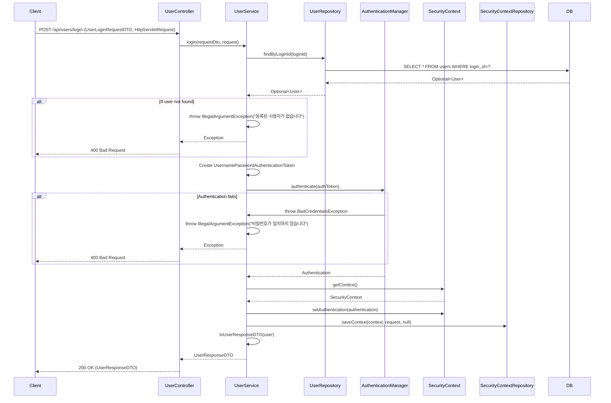

## Login Sequence Diagram

## 로그인 (POST `/api/users/login`)

| 항목 | 흐름 요약 | 핵심 비즈니스 로직 |
|:---|:---|:---|
| **목표** | 사용자 인증 및 세션 생성 | - |
| **요청 수신** | `Client`가 loginId와 loginPwd를 전달하면 `Controller`는 `UserLoginRequestDTO`를 통해 `Service`로 전달합니다. | - |
| **사용자 조회** | `UserService`는 `UserRepository`의 `findByLoginId`를 통해 **사용자가 존재하는지** 확인합니다. | **사용자 존재 확인** (예외 처리) |
| **인증 토큰 생성** | `UsernamePasswordAuthenticationToken`을 생성합니다. | - |
| **인증 수행** | `AuthenticationManager`가 **비밀번호를 검증**합니다. | **비밀번호 검증** |
| **인증 실패 처리** | 비밀번호가 일치하지 않으면 `BadCredentialsException`을 발생시킵니다. | 인증 실패 예외 처리 |
| **세션 생성** | 인증 성공 시 `SecurityContext`에 **인증 정보를 저장**하고 `SecurityContextRepository`를 통해 **세션을 생성**합니다. | **세션 기반 인증 상태 유지** |
| **응답 반환** | `Service`는 저장된 사용자 정보를 DTO로 변환하여 `Controller`를 거쳐 `Client`에게 **HTTP 200 OK** 응답과 함께 반환합니다. | - |
